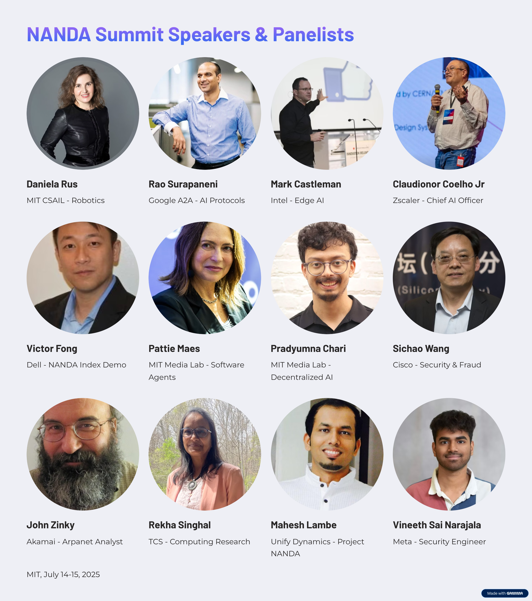

#  Project NANDA: Building the Agentic Web

> **The future isn't just AI - it's trillions of AI agents collaborating across the open web securely**

---
## Project NANDA

**Project NANDA** is building the foundational infrastructure for the **Open Agentic Web** - a system where trillions of AI agents can collaborate, communicate, and transact across organizational boundaries without bottlenecks or security vulnerabilities. NANDA addresses the core challenge: how can billions or even trillions of AI agents discover each other, verify capabilities, and coordinate tasks without creating bottlenecks or security vulnerabilities. The project develops both the technical infrastructure (index - interop links between all heterogenous agent registries, protocols, SDKs) and the governance frameworks needed for a responsible, **Open Agentic Web**.

NANDA provides the **index**, **protocols**, and **tools** needed to enable this decentralized, protocol-neutral ecosystem. 

###  Learn More
- **[View All Research Papers](https://projnanda.github.io/projnanda/#/?id=research-amp-publications)** - Latest research papers outlining the architectural, strategic, and technical foundations of the NANDA
- **[Project NANDA FAQ](https://projnanda.github.io/projnanda/#/faq_nanda)** - Comprehensive Q&A about the project
- **[NANDA & A2A FAQ](https://projnanda.github.io/projnanda/#/faq_nanda_a2a)** - NANDA Index - contextualizing with Linux Foundation Agent2Agent Project
- **[GitHub Repositories](https://github.com/projnanda)** - All open-source code for Agents, Index, Adapter SDK

---

##  Development Roadmap

### Phase 1: Foundations of Agentic Web 
**Foundation/Onboarding/Index**
- Index Infrastructure: NANDA Index for agent discovery and identity
- Cross-Platform Communication: Protocol bridges between A2A, MCP, HTTPS
- Agent Onboarding: SDKs and tools for easy agent deployment
- Interoperability: Standards for agents to work across different platforms

### Phase 2: Agentic Commerce 
**Knowledge pricing, edge AI**
- Knowledge Pricing: Mechanisms for agents to value and exchange information
- Edge AI Integration: Distributed intelligence at network edges
- Economic Protocols: Payment and incentive systems for agent services
- Resource Markets: Platforms for trading compute, data, and capabilities

### Phase 3: Society of Agents 
**Large Population Models, co-learning, Agents across data silos**
- Large Population Models (LPMs): Collective intelligence from agent populations
- Collaborative Learning: Agents learning together while preserving privacy
- Cross-Silo Coordination: Agents working across organizational data boundaries
- Distributed AI: Split learning and inference across agent networks

---
##  Goals

### Short term goals
**Research:** 
- High-quality algorithmic research and perspective papers (see current research at NANDA Papers Repository) 
- Creating partnerships between companies, startups, and academics

**Impact:** 
- Awareness: Educating about the need for an open, neutral Internet of AI Agents
- Responsible Governance: Promoting ethical use and governance frameworks for AI agents

**Lab to market (Tech Transfer and Venture Enablement):**
- Reference Implementations: Open-source tools and community development
- Ecosystem Building: Connecting startups, corporations, and investors for robust solutions

### Long terms goals
**Research**
- Academic Infrastructure: Establishing journals, conferences, and NSF programs for agentic web research
- Algorithmic Advancement: Developing algorithms to enable the society of AI agents

**Impact**
- Open Framework: Creating equitable systems for agentic commerce
- Global Standards: Establishing protocols for responsible agent interaction

**Lab to Market**
- Government Engagement: Stimulating public sector adoption and policy development
- Corporate Unlocking: Enabling enterprises to safely deploy agent ecosystems
---

##  Research & Publications

Our research papers outline the architectural, strategic, and technical foundations:

###  Latest Research Papers

 **[Beyond DNS: Unlocking the Internet of AI Agents via the NANDA Index, Verified AgentFacts and Adaptive Resolution](https://arxiv.org/abs/2507.14263)** - Details the design of a minimal, privacy-preserving registry architecture for agent discovery. Introduces the AgentFacts schema, TTL-based endpoint resolution, and cryptographic verification for agent capabilities. Offers concrete mechanisms for multi-endpoint routing, least-disclosure queries, and rapid revocation in decentralized agent ecosystems. 

**[Upgrade or Switch – The Need for New Registry](https://arxiv.org/abs/2506.12003)** - Analyzes the limitations of DNS and web infrastructure for AI agent systems. Weighs incremental upgrades (e.g., DNS push, SVCB records) against purpose-built registries. Offers analogies like dial-up to broadband and outlines the technical deltas introduced by the agent paradigm.   | **[Read Full Paper](upgrade_or_switch.md)**

**[NANDA Adaptive Resolver: Architecture for Dynamic Resolution of AI Agent Names](https://arxiv.org/abs/2508.03113)** - AdaptiveResolver is a dynamic microservice architecture designed to address the limitations of static endpoint resolution for AI agent communication in distributed, heterogeneous environments.     

**[Using the NANDA Index Architecture in Practice: An Enterprise Perspective](https://arxiv.org/abs/2508.03101)** - Presents the NANDA framework for secure AI agent ecosystems and cross-protocol interoperability, and explores enterprise use cases. Introduces Zero Trust Agentic Access (ZTAA) and Agent Visibility & Control (AVC) for enterprise governance of autonomous agent collaboration.  

**[Survey of AI Agent Registry Solutions](https://arxiv.org/abs/2508.03095)** - Compares leading registry architectures - MCP, A2A, Microsoft Entra Agent ID, and NANDA, across security, scalability, authentication, and maintainability. Highlights NANDA’s AgentFacts as a privacy-preserving, cryptographically verifiable schema purpose-built for dynamic, multi-agent systems.  

**[Join Writing Group](https://projnanda.github.io/projnanda/#/./home/onboardingwritinggroup)**

---

##  Our Belief

The web will evolve from static content to dynamic services to autonomous actors. AI models will not just generate content but carry out actions on our behalf. Registries and protocols must be open to prevent capture and enable global participation.

**Join us in building the next layer of the web.**

---

##  Community & Collaboration

### Get Involved

- **[Discord](https://discord.gg/BxnPBEqd88)** - Join ongoing conversations
- **[Events](https://Lu.Ma/nanda)** - Weekly webinars and technical discussions
- **[YouTube](https://www.youtube.com/@ProjectNANDA)** - Latest demos and talks
- **[Newsletter](https://forms.gle/bnVRV2zr8M5Kotfr7)** - Stay updated

### Opportunities

- **Research**: Contribute to papers and algorithmic development
- **Development**: Fork SDKs, build integrations, propose improvements
- **Ecosystem**: Connect startups, corporations, and academic institutions
- **[Tresata Fellowship](https://docs.google.com/forms/d/e/1FAIpQLSemeT9K8WGbggXbFvKlEYj_TQyVrSupxAUonV_W7kO6GOFSIg/viewform)** - Paid Roles Available
- **[Radius Fellowship](https://www.linkedin.com/jobs/view/4260498540/)** - Paid roles available

---

##  See It In Action

*Click to watch our latest demo*

---

##  Partnership & Enterprise

     

**Corporate Coalition**: Multiple companies participating in development and standardization

**Academic Network**: Research partnerships

**Open Source**: All components distributed under MIT License

**Government Engagement**: Stimulating public sector adoption and policy development

---

##  Additional Resources

###  Project NANDA Resource Map

####  Official Sites
 **Home:** [projectnanda.org](https://projectnanda.org)  
 **Docs (GitHub Pages):** [projnanda.github.io/projnanda](https://projnanda.github.io/projnanda/)  
 **July 2025 Summit Site:** [july2025.projectnanda.org](https://july2025.projectnanda.org)  

####  Articles & Blog Posts
 **“NANDA: The Internet of AI Agents”** — Ramesh Raskar (LinkedIn)  
  <https://www.linkedin.com/pulse/nanda-internet-ai-agents-ramesh-raskar-211ve>  
 **Review of NANDA** — Ben Xiaojun Li (LinkedIn)  
  <https://www.linkedin.com/pulse/review-mit-nanda-internet-ai-agents-ben-xiaojun-li-am7hc>  
 **Forbes:** *“Line Up and Identify Yourselves — AI Agents Get Organized with NANDA”*  
  <https://www.forbes.com/sites/johnwerner/2025/07/08/line-up-and-identify-yourselves-ai-agents-get-organized-with-nanda/>  
 **Forbes:** *“Make a Decentralized Internet with AI — NANDA Is Coming”*  
  <https://www.forbes.com/sites/johnwerner/2025/05/13/make-a-decentralized-internet-with-ai-nanda-is-coming/>  
 **Vana:** *MIT Decentralized AI Summit Recap*  
  <https://www.vana.org/posts/mit-decentralized-ai-summit>  

####  Videos & Media
 **Intro to NANDA (YouTube)** — “Network of AI Agents & Decentralized Internet”  
  <https://www.youtube.com/watch?v=jlcO19XyQ1I>  
 **Project NANDA Overview Talk (YouTube)**  
  <https://www.youtube.com/watch?v=vCeiA0T8kTM>  
 **Decentralized AI Summit Panel (YouTube)**  
  <https://www.youtube.com/watch?v=oDRyxMUum4A>  

####  Community & Social
-  **LinkedIn Page:** <https://www.linkedin.com/company/projectnanda>  
-  **Launch Post:** “Intro to NANDA — Network of AI Agents”  
  <https://www.linkedin.com/posts/projectnanda_intro-to-nanda-network-of-ai-agents-and-activity-7334281216088535041-PeLm>  

####  Events & Registrations
-  **Tech Jobs for Good — Summit Listing:**  
  <https://techjobsforgood.com/events/projectnanda-2-day-summit-at-mit-intranet-to-internet-of-ai-agents>  
-  **RSVP (Lu.ma):** <https://lu.ma/s2d3a797>  

---

**Made with ♥ by the NANDA Community**

*Building the Open Agentic Web*

