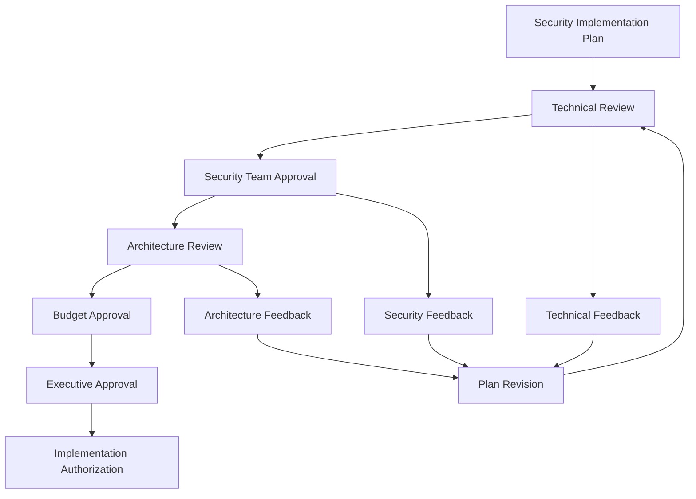

# NANDA Security Implementation Plan - Proposed for Approval

## Document Status

**Status**: Proposed - Pending Approval  
**Version**: 1.0  
**Date**: 2025-01-20  
**Author**: Security Analysis Team (parmarmanojkumar)  
**Approval Required From**:  
- [ ] Security Team Lead
- [ ] Architecture Team Lead  
- [ ] Product Owner
- [ ] Engineering Manager
- [ ] DevOps/Infrastructure Team

## Executive Summary

This implementation plan is derived from comprehensive security analysis of all three NANDA components using advanced AI security frameworks (OWASP LLM/Agentic AI Top 10, MITRE ATLAS, MAESTRO). The analysis revealed **CRITICAL security vulnerabilities** requiring immediate emergency intervention across all components.

**Risk Status**: Production deployment halt required for NANDA-INDEX and NANDA-AGENT components.

## Implementation Strategy

### Phased Approach Rationale

The implementation follows a **Risk-First, Phased Delivery** strategy:

1. **Emergency Phase (1-2 weeks)**: Address critical vulnerabilities preventing production deployment
2. **Foundation Phase (1-3 months)**: Implement core enterprise security controls
3. **Integration Phase (3-6 months)**: Deploy advanced security architecture and compliance
4. **Optimization Phase (6-12 months)**: Advanced AI security controls and certifications

## Phase 0: Emergency Security Implementation (Weeks 1-2)

### Priority: P0 - CRITICAL

**Objective**: Make components production-safe by addressing critical vulnerabilities

### Component-Specific Implementation

#### 🚨 NANDA-INDEX Emergency Implementation

**Current Status**: Security Level 0/5 - Production Deployment HALTED

##### Week 1 Implementation Tasks

**Day 1-2: Authentication Framework**
```yaml
Task: Implement Basic API Authentication
Priority: P0
Effort: 1-2 days
Dependencies: None
Owner: Backend Developer + Security Engineer
```

**Implementation Details:**
- Add Flask-based API key authentication
- Create API key generation and validation system
- Implement request authentication middleware
- Add authentication failure logging

**Acceptance Criteria:**
- [ ] All endpoints require valid API key
- [ ] Invalid authentication returns 401 status
- [ ] Authentication failures are logged
- [ ] API key generation system operational

**Day 2-3: Input Validation**
```yaml
Task: Implement Comprehensive Input Validation
Priority: P0
Effort: 1-2 days
Dependencies: Authentication framework
Owner: Backend Developer
```

**Implementation Details:**
- Deploy Marshmallow schema validation
- Add input sanitization for all endpoints
- Implement parameterized database queries
- Add input length and type validation

**Acceptance Criteria:**
- [ ] All inputs validated against schemas
- [ ] No dynamic SQL queries remain
- [ ] Malicious input attempts blocked and logged
- [ ] Input validation errors return structured responses

**Day 3-4: Database Security**
```yaml
Task: Secure MongoDB Configuration
Priority: P0
Effort: 1-2 days
Dependencies: None
Owner: DevOps + Backend Developer
```

**Implementation Details:**
- Remove hardcoded MongoDB credentials
- Implement MongoDB authentication
- Enable TLS for database connections
- Configure MongoDB audit logging

**Acceptance Criteria:**
- [ ] No hardcoded credentials in codebase
- [ ] MongoDB requires authentication
- [ ] All connections use TLS encryption
- [ ] Database access logging enabled

**Day 4-5: Rate Limiting & DDoS Protection**
```yaml
Task: Implement Traffic Control
Priority: P0
Effort: 1 day
Dependencies: Authentication
Owner: Backend Developer
```

**Implementation Details:**
- Deploy Flask-Limiter for rate limiting
- Configure endpoint-specific rate limits
- Add IP-based blocking for abuse
- Implement monitoring for rate limit violations

**Acceptance Criteria:**
- [ ] Rate limits enforced on all endpoints
- [ ] Abuse detection and blocking operational
- [ ] Rate limit violations logged and monitored

#### 🚨 NANDA-AGENT Emergency Implementation

**Current Status**: Security Level 1/5 - Access Restricted

##### Week 1 Implementation Tasks

**Day 1: Secrets Management**
```yaml
Task: Remove Hardcoded Secrets
Priority: P0
Effort: 1 day
Dependencies: None
Owner: AI/ML Developer + Security Engineer
```

**Implementation Details:**
- Audit codebase for hardcoded API keys
- Implement environment-based configuration
- Add secrets validation at startup
- Update deployment configurations

**Acceptance Criteria:**
- [ ] No hardcoded secrets in codebase
- [ ] All API keys loaded from environment
- [ ] Startup validation for required secrets
- [ ] Deployment configs updated

**Day 2-3: Prompt Injection Protection**
```yaml
Task: Implement AI Input Sanitization
Priority: P0
Effort: 2 days
Dependencies: None
Owner: AI/ML Developer + Security Engineer
```

**Implementation Details:**
- Deploy prompt injection detection patterns
- Implement input sanitization pipeline
- Add conversation context validation
- Create prompt injection monitoring

**Acceptance Criteria:**
- [ ] Dangerous prompt patterns detected and blocked
- [ ] Input sanitization applied to all user inputs
- [ ] Conversation context preserved securely
- [ ] Prompt injection attempts logged

**Day 3-4: Conversation Encryption**
```yaml
Task: Secure Conversation Storage
Priority: P0
Effort: 1-2 days
Dependencies: None
Owner: Backend Developer + Security Engineer
```

**Implementation Details:**
- Implement conversation encryption at rest
- Add secure key management for encryption
- Update logging to use encrypted storage
- Implement secure conversation retrieval

**Acceptance Criteria:**
- [ ] All conversations encrypted before storage
- [ ] Encryption keys managed securely
- [ ] Conversation retrieval includes decryption
- [ ] Key rotation mechanism implemented

**Day 4-5: Input Validation & DoS Protection**
```yaml
Task: Agent Input Security
Priority: P0
Effort: 1 day
Dependencies: Prompt injection protection
Owner: AI/ML Developer
```

**Implementation Details:**
- Add input length validation
- Implement malicious pattern detection
- Add resource usage monitoring
- Create input validation reporting

**Acceptance Criteria:**
- [ ] Input length limits enforced
- [ ] Malicious patterns detected and blocked
- [ ] Resource usage monitored and limited
- [ ] Validation failures logged

#### 🔴 NANDA-ADAPTER Emergency Implementation

**Current Status**: Security Level 2/5 - Monitor Closely

##### Week 1 Implementation Tasks

**Day 1-3: Framework Sandboxing**
```yaml
Task: Implement Execution Sandboxing
Priority: P0
Effort: 2-3 days
Dependencies: None
Owner: Framework Integration Developer + Security Engineer
```

**Implementation Details:**
- Implement subprocess-based execution isolation
- Add resource limits for CPU and memory
- Create execution timeout mechanisms
- Implement framework-specific security controls

**Acceptance Criteria:**
- [ ] Framework code runs in isolated environment
- [ ] CPU and memory limits enforced
- [ ] Execution timeouts prevent hanging
- [ ] Sandbox violations logged and blocked

**Day 2-3: API Key Security**
```yaml
Task: Secure Third-party API Management
Priority: P0
Effort: 1-2 days
Dependencies: None
Owner: Framework Integration Developer
```

**Implementation Details:**
- Remove hardcoded API keys from examples
- Implement secure API key injection
- Add API key validation for frameworks
- Create API key usage monitoring

**Acceptance Criteria:**
- [ ] No hardcoded keys in example code
- [ ] API keys injected securely at runtime
- [ ] Invalid API keys detected and blocked
- [ ] API key usage monitored

**Day 3-4: Input Validation at Boundaries**
```yaml
Task: Framework Integration Security
Priority: P0
Effort: 1-2 days
Dependencies: Sandboxing
Owner: Framework Integration Developer
```

**Implementation Details:**
- Validate framework names against allowlist
- Implement input schema validation
- Add malicious code detection
- Create framework integration logging

**Acceptance Criteria:**
- [ ] Only approved frameworks allowed
- [ ] Input schemas validated before execution
- [ ] Potentially malicious code blocked
- [ ] Framework interactions logged

### Week 2: Cross-Component Integration

**Day 8-9: TLS 1.3 Deployment**
```yaml
Task: Secure Communications
Priority: P1
Effort: 2 days
Dependencies: Individual component fixes
Owner: DevOps + Security Engineer
```

**Day 10-11: Unified Security Monitoring**
```yaml
Task: Centralized Security Logging
Priority: P1
Effort: 2 days
Dependencies: TLS deployment
Owner: DevOps + Security Engineer
```

**Day 12-13: Automated Security Testing**
```yaml
Task: Security Test Automation
Priority: P1
Effort: 2 days
Dependencies: Monitoring
Owner: QA + Security Engineer
```

**Day 14: Security Validation & Approval**
```yaml
Task: Production Readiness Assessment
Priority: P1
Effort: 1 day
Dependencies: All emergency fixes
Owner: Security Team Lead
```

## Phase 1: Critical Security Foundation (Months 1-3)

### Priority: P1 - HIGH

**Objective**: Establish enterprise-grade security foundation across all components

### Cross-Component Security Controls

#### Authentication & Authorization (Month 1)
```yaml
Epic: Unified Identity Management
Priority: P1
Duration: 4 weeks
Owner: Security Team + Backend Team

Stories:
- Implement OIDC authentication across all components
- Deploy multi-factor authentication for admin access
- Create role-based access control (RBAC) framework
- Implement JWT token management with rotation
```

#### Cryptographic Security (Month 1-2)
```yaml
Epic: Cryptographic Infrastructure
Priority: P1
Duration: 6 weeks
Owner: Security Team + DevOps Team

Stories:
- Deploy Hardware Security Module (HSM) integration
- Implement EdDSA signatures for agent verification
- Add cryptographic signing for agent packages
- Create secure key management lifecycle
```

#### Input Validation Framework (Month 2)
```yaml
Epic: Comprehensive Input Security
Priority: P1
Duration: 4 weeks
Owner: Backend Team + Security Team

Stories:
- Create unified input validation library
- Implement Content Security Policy (CSP)
- Deploy advanced rate limiting and DDoS protection
- Add input validation testing framework
```

#### CI/CD Security Integration (Month 2-3)
```yaml
Epic: Secure Development Pipeline
Priority: P1
Duration: 6 weeks
Owner: DevOps Team + Security Team

Stories:
- Implement automated security scanning in CI/CD
- Add dependency vulnerability scanning
- Create security-focused code review process
- Deploy SBOM generation for all components
```

### AI-Specific Security Implementation

#### OWASP LLM Top 10 Controls (Month 2-3)
```yaml
Epic: LLM Security Framework
Priority: P1
Duration: 6 weeks
Owner: AI/ML Team + Security Team

Stories:
- Implement advanced prompt injection protection
- Add model denial of service protection
- Create supply chain vulnerability scanning for AI models
- Deploy sensitive information disclosure prevention
```

#### OWASP Agentic AI Top 10 Controls (Month 3)
```yaml
Epic: Multi-Agent Security
Priority: P1
Duration: 4 weeks
Owner: Agent Team + Security Team

Stories:
- Implement agent behavior monitoring
- Add inter-agent communication security
- Create agent capability verification system
- Deploy agent reputation and trust scoring
```

## Phase 2: Enterprise Security Integration (Months 3-6)

### Priority: P2 - MEDIUM

**Objective**: Implement advanced security architecture and compliance frameworks

### Advanced Security Architecture

#### Zero Trust Implementation (Month 3-4)
```yaml
Epic: Zero Trust Network Architecture
Priority: P2
Duration: 8 weeks
Owner: Network Security Team + DevOps Team

Stories:
- Implement network micro-segmentation
- Deploy identity-based network access controls
- Add continuous security posture monitoring
- Create adaptive security policies
```

#### SIEM and Security Monitoring (Month 4-5)
```yaml
Epic: Security Operations Center
Priority: P2
Duration: 8 weeks
Owner: Security Operations Team

Stories:
- Deploy enterprise SIEM solution
- Implement real-time threat detection
- Create security incident response automation
- Add behavioral anomaly detection
```

### Compliance and Governance

#### SOC2 Type II Preparation (Month 4-6)
```yaml
Epic: SOC2 Compliance Program
Priority: P2
Duration: 12 weeks
Owner: Compliance Team + Security Team

Stories:
- Conduct SOC2 readiness assessment
- Implement required security controls
- Create compliance documentation and evidence collection
- Perform pre-audit security assessment
```

#### GDPR Privacy Controls (Month 5-6)
```yaml
Epic: Privacy by Design Implementation
Priority: P2
Duration: 8 weeks
Owner: Privacy Team + Engineering Team

Stories:
- Implement data minimization controls
- Add privacy impact assessment process
- Create data subject rights management
- Deploy privacy-preserving technologies
```

## Phase 3: Advanced Security & Privacy (Months 6-12)

### Priority: P3 - MEDIUM-LOW

**Objective**: Deploy cutting-edge AI security and achieve security certifications

### Advanced AI Security

#### Privacy-Enhancing Technologies (Month 6-8)
```yaml
Epic: Advanced Privacy Protection
Priority: P3
Duration: 12 weeks
Owner: Privacy Engineering Team + AI Research Team

Stories:
- Implement differential privacy for analytics
- Add homomorphic encryption for sensitive computations
- Deploy federated learning security controls
- Create zero-knowledge proof systems
```

#### Adversarial Attack Protection (Month 8-10)
```yaml
Epic: AI Attack Resilience
Priority: P3
Duration: 10 weeks
Owner: AI Security Team + ML Engineering Team

Stories:
- Implement adversarial example detection
- Add model poisoning prevention
- Create AI attack monitoring and response
- Deploy model integrity verification
```

### Security Certifications and Audits

#### Third-Party Security Audit (Month 10-11)
```yaml
Epic: Independent Security Assessment
Priority: P3
Duration: 8 weeks
Owner: Security Team + External Auditors

Stories:
- Conduct comprehensive penetration testing
- Perform security architecture review
- Complete vulnerability assessment
- Create security remediation roadmap
```

#### Security Certifications (Month 11-12)
```yaml
Epic: Security Standards Compliance
Priority: P3
Duration: 8 weeks
Owner: Compliance Team + Security Team

Stories:
- Achieve OWASP ASVS Level 2 verification
- Complete ISO 27001 certification process
- Obtain industry-specific security certifications
- Implement continuous compliance monitoring
```

## Implementation Resources and Requirements

### Team Composition Requirements

```yaml
Core Security Team:
  Security Engineer (Lead): 1 FTE
  Application Security Engineer: 1 FTE
  AI Security Specialist: 1 FTE (for AI-specific controls)
  DevSecOps Engineer: 1 FTE

Development Teams:
  Backend Developers: 2-3 FTE (across phases)
  AI/ML Developers: 2 FTE (for agent security)
  Frontend Developer: 1 FTE (for UI security)
  QA Security Specialist: 1 FTE

Operations Teams:
  DevOps Engineers: 2 FTE
  Site Reliability Engineer: 1 FTE
  Compliance Specialist: 0.5 FTE

External Resources:
  Security Consultant: As needed for audits
  Penetration Testing Firm: Phase 2-3
  Compliance Auditor: Phase 2-3
```

### Infrastructure Requirements

#### Emergency Phase Infrastructure
```yaml
Immediate Requirements:
  - API Gateway for authentication
  - MongoDB with TLS and authentication
  - Basic logging and monitoring stack
  - SSL certificates for all endpoints

Estimated Cost: $500-1,000/month
```

#### Foundation Phase Infrastructure
```yaml
Core Security Infrastructure:
  - Hardware Security Module (HSM) or cloud equivalent
  - Enterprise SIEM solution
  - Identity Provider (OIDC/OAuth2)
  - Certificate management system
  - Vulnerability scanning tools
  - Code security analysis tools

Estimated Cost: $5,000-10,000/month
```

#### Advanced Phase Infrastructure
```yaml
Enterprise Security Stack:
  - Advanced threat detection platform
  - Security orchestration and automation
  - Privacy-enhancing technology stack
  - Compliance management platform
  - Advanced monitoring and analytics

Estimated Cost: $15,000-25,000/month
```

### Technology Stack Decisions

#### Security Technology Choices

**Authentication & Authorization:**
- Primary: Auth0 or Keycloak for OIDC
- Alternative: AWS Cognito or Azure AD B2C
- Justification: Standards-based, scalable, enterprise-ready

**Encryption & Key Management:**
- Primary: AWS KMS or Azure Key Vault
- Alternative: HashiCorp Vault
- Justification: Managed service, HSM-backed, compliance ready

**SIEM and Monitoring:**
- Primary: Splunk or Elastic Security
- Alternative: AWS Security Hub or Azure Sentinel
- Justification: AI/ML capabilities, scalability, integration

**Code Security:**
- Static Analysis: SonarQube or Veracode
- Dependency Scanning: Snyk or OWASP Dependency Check
- Container Security: Aqua or Twistlock
- Justification: Comprehensive coverage, CI/CD integration

## Risk Management and Mitigation

### Implementation Risks

#### Technical Risks
```yaml
Risk: Performance Impact from Security Controls
Probability: Medium
Impact: Medium
Mitigation:
  - Performance testing at each phase
  - Optimize security controls implementation
  - Use caching and CDN where appropriate
  - Monitor performance metrics continuously

Risk: Integration Complexity with Existing Systems  
Probability: High
Impact: Medium
Mitigation:
  - Detailed integration testing
  - Phased rollout with rollback capabilities
  - Comprehensive documentation and training
  - Dedicated integration team
```

#### Resource Risks
```yaml
Risk: Insufficient Security Expertise
Probability: Medium
Impact: High
Mitigation:
  - Early recruitment of security specialists
  - External consulting for specialized areas
  - Training programs for existing team
  - Knowledge transfer documentation

Risk: Budget Overruns
Probability: Medium
Impact: High
Mitigation:
  - Detailed cost estimates with contingency
  - Regular budget reviews and adjustments
  - Prioritization of critical security controls
  - Phased implementation to spread costs
```

#### Timeline Risks
```yaml
Risk: Emergency Phase Delays
Probability: Medium
Impact: Critical
Mitigation:
  - Dedicated emergency response team
  - Pre-approved emergency procurement
  - Parallel development where possible
  - Daily progress reviews

Risk: Compliance Timeline Pressure
Probability: High
Impact: High
Mitigation:
  - Early engagement with compliance team
  - Regular compliance assessments
  - External compliance consulting
  - Buffer time in compliance milestones
```

## Success Criteria and Metrics

### Emergency Phase Success Criteria (Week 2)

**Security Metrics:**
- [ ] Zero critical vulnerabilities in production components
- [ ] 100% authentication coverage on all endpoints
- [ ] Input validation implemented on all user inputs
- [ ] Database security controls operational
- [ ] Rate limiting and DDoS protection active

**Operational Metrics:**
- [ ] Production deployment approval obtained
- [ ] Security monitoring operational
- [ ] Incident response procedures tested
- [ ] Emergency rollback procedures validated

### Foundation Phase Success Criteria (Month 3)

**Security Architecture:**
- [ ] OIDC authentication deployed across all components
- [ ] Cryptographic signing operational for all agent packages
- [ ] Input validation framework covering 100% of inputs
- [ ] Automated security scanning in CI/CD pipeline
- [ ] Vulnerability management process operational

**AI Security:**
- [ ] OWASP LLM Top 10 controls implemented
- [ ] Prompt injection protection active
- [ ] AI model security scanning operational
- [ ] Agent behavior monitoring deployed

### Integration Phase Success Criteria (Month 6)

**Enterprise Security:**
- [ ] Zero trust architecture operational
- [ ] SIEM deployment complete with 24/7 monitoring
- [ ] SOC2 Type II audit initiated
- [ ] GDPR compliance controls implemented
- [ ] Security incident response automation active

### Advanced Phase Success Criteria (Month 12)

**Advanced Security:**
- [ ] Privacy-enhancing technologies deployed
- [ ] Adversarial attack protection operational
- [ ] Third-party security audit completed with acceptable results
- [ ] Security certifications achieved (SOC2, OWASP ASVS Level 2)
- [ ] Continuous security improvement process operational

## Approval and Sign-off Process

### Implementation Plan Approval Workflow



### Required Approvals

#### Phase 0 (Emergency) - Required within 48 hours
- [ ] **Security Team Lead**: Technical security approach
- [ ] **Engineering Manager**: Resource allocation and timeline
- [ ] **DevOps Team Lead**: Infrastructure and deployment approach
- [ ] **Product Owner**: Business impact and priority alignment

#### Phase 1 (Foundation) - Required within 1 week
- [ ] **Architecture Team**: Security architecture design
- [ ] **Budget Owner**: Financial approval for security infrastructure
- [ ] **Compliance Team**: Regulatory and compliance requirements
- [ ] **Executive Sponsor**: Strategic approval and commitment

#### Phase 2-3 (Advanced) - Required within 2 weeks
- [ ] **CTO/Technical Executive**: Long-term technical strategy
- [ ] **Legal Team**: Privacy and regulatory compliance
- [ ] **External Security Consultant**: Independent validation
- [ ] **Board/Stakeholders**: Major investment approval

### Approval Documentation

Each approver must provide:
1. **Written approval** with digital signature
2. **Risk acknowledgment** of delayed implementation
3. **Resource commitment** confirmation
4. **Success criteria agreement**
5. **Review milestone acknowledgment**

## Implementation Governance

### Progress Tracking and Reporting

#### Daily Standups (Emergency Phase)
- Progress on critical security fixes
- Blockers and impediment resolution
- Risk escalation and mitigation
- Resource needs and adjustments

#### Weekly Security Reviews (All Phases)
- Implementation progress against plan
- Security metrics and KPIs review
- Risk assessment updates
- Stakeholder communication

#### Monthly Steering Committee (Foundation Phase+)
- Overall program progress
- Budget and resource review
- Strategic alignment assessment
- External audit and compliance updates

### Change Management Process

#### Plan Modification Approval
```yaml
Minor Changes (< 1 week impact):
  Approver: Security Team Lead + Engineering Manager
  Process: Email approval within 24 hours

Major Changes (> 1 week impact):
  Approver: All original plan approvers
  Process: Formal review meeting within 48 hours

Critical Changes (timeline or budget impact > 20%):
  Approver: Executive sponsor + steering committee
  Process: Emergency approval process within 24 hours
```

---

**Implementation Plan Version**: 1.0  
**Next Review Date**: Weekly until Phase 0 completion, then monthly  
**Plan Owner**: Security Analysis Team (parmarmanojkumar)  
**Last Updated**: 2025-01-20

**APPROVAL REQUIRED**: This implementation plan requires formal approval before execution. Emergency Phase implementation should begin immediately upon approval due to critical security vulnerabilities identified in the security analysis.
