

  <!-- Logo and Headline in Single Line -->
  

    
    <h1 style="font-size: 2rem; font-weight: 700; color: var(--nanda-black); margin: 0; line-height: 1.2;">
      Architecting Internet of AI Agents
    </h1>
  

  <!-- Mission Statement - Big and Prominent -->
  

    

      The future isn't just AI, it's <strong>trillions of AI agents collaborating across the open web, securely.</strong>
    

  

  <!-- Social Badges -->
  

    
    
    
    
  

---

## What is Project NANDA?

  

    Project NANDA is architecting the foundational infrastructure for the <strong style="color: var(--nanda-yellow-dark);">Open Agentic Web</strong>.
  

  

    We are solving the core challenge of the next decade: <strong>How can billions of AI agents discover each other, verify capabilities, and coordinate tasks without creating bottlenecks or security vulnerabilities?</strong>
  

  <h3 style="color: var(--nanda-black); margin-top: 0; margin-bottom: 20px; font-size: 1.4rem; border-left: none; padding-left: 0;">About NANDA</h3>
  

    <strong>Project NANDA</strong> (Networked AI Agents in Decentralized Architecture) originated at MIT and aims to dismantle the four critical choke points within this ecosystem's infrastructure by focusing on consensus-driven innovation:
  

  

    
DNS

    
CA

    
Orchestration

    
Attestation

  

  

    We are pioneering the foundational infrastructure for the Internet of AI Agents — enabling autonomous systems to <strong>interact, transact, and collaborate seamlessly</strong>.
  

### Our Three-Pronged Approach

  

    
1

    <h4 style="color: var(--nanda-black); margin: 0 0 15px 0; font-size: 1.25rem;">Technology</h4>
    
Building technology, standards, and reference implementations through a collective of top minds.

  

  

    
2

    <h4 style="color: var(--nanda-black); margin: 0 0 15px 0; font-size: 1.25rem;">Social Mission</h4>
    
Working to maintain an open Agentic Web for innovators while ensuring safety for vulnerable populations.

  

  

    
3

    <h4 style="color: var(--nanda-black); margin: 0 0 15px 0; font-size: 1.25rem;">Venture Ecosystem</h4>
    
Fostering a wide coalition of founders and investors.

  

  

    <strong style="color: var(--nanda-black);">Built on proven MIT research</strong> in AutoML, split learning, privacy-preserving architectures, and decentralized coordination. Early partners in the coalition gain preferential access to emerging standards, reference implementations, and the academic-industry consortium that will influence the emerging frameworks globally.
  

---

## Community Mentions

  

    Project NANDA discussions have included speakers, advisors, and contributors from:
  

  

    MIT • Dell Technologies • Microsoft • OpenAI • Google • Qualcomm • Deloitte • Akamai • Salesforce • Snowflake • Coinbase • Capgemini • UC Berkeley • Nutanix • NVIDIA • Indeed • Stanford • Ericsson • Cisco • AWS • Zapier • GoDaddy • Meta • Intel • Zscaler • FCC • Audible • EPFL • Tresata • Vana • Radius • MyLife • Head Held High Foundation • Stony Brook University • NSE • TCS • HADERA • Mayfield Ventures • WestWave Capital
  

  

    
6000+

    
Community Members

    
Global Network Participants

  

  

    
61

    
Collaborations

    
Leading Organizations

  

  

    
15+

    
Papers

    
Research Publications

  

  

    
50+

    
Webinars

    
Education Sessions

  

  

    
12

    
Hackathons

    
Innovation Challenges

  

  

    
100+

    
Speakers

    
Industry Experts

  

  

    
75+

    
Projects

    
Active Initiatives

  

  

    
18

    
Locations

    
Global Hubs

  

## Research & Publications

Our research outlines the architectural and strategic foundations of the Agentic Web.

### Foundational Architecture Papers

| Paper Title | Description | Links |
| :--- | :--- | :--- |
| **Beyond DNS: Unlocking the Internet of AI Agents** | *The foundational paper.* Details the design of the NANDA Index, AgentFacts schema, and Verified Agent Discovery. |  |
| **Upgrade or Switch: The Need for New Registry** | Analyzes why DNS fails for AI agents and weighs incremental upgrades against purpose-built registries. |  |
| **NANDA Adaptive Resolver** | A dynamic microservice architecture for agent name resolution in distributed environments. |  |
| **NANDA in Practice: Enterprise Perspective** | Explores Zero Trust Agentic Access (ZTAA) and governance for enterprise agent ecosystems. |  |
| **Survey of AI Agent Registry Solutions** | Compares NANDA, MCP, A2A, and MS Entra across security, scalability, and maintainability. |  |

### Interoperability & Specialized Research Papers

| Paper Title | Description | Links |
| :--- | :--- | :--- |
| **Towards Sandboxes for the Internet of Agents** | Proposes a network of domain-specialized sandboxes to verify agent capabilities via signed, replayable attestations. |  |
| **Collaborative Agentic AI Needs Interoperability Across Ecosystems** | Proposes "Web of Agents," a minimal architectural foundation to ensure interoperability and prevent ecosystem fragmentation. |  |
| **The Iceberg Index: Measuring Workforce Exposure Across the AI Economy** | Introduces the Iceberg Index using Large Population Models to measure workforce exposure to AI based on underlying skills. |  |
| **Ripple Effect Protocol: Coordinating Agent Populations** | Introduces a protocol enabling faster agent coordination by sharing decision sensitivities alongside choices. |  |
| **Evolution of AI Agent Registry Solutions** | Analyzes five registry approaches (including AGNTCY and MS Entra) and offers design recommendations for verifiable identity. |  |
| **The Trust Fabric: Decentralized Interoperability** | Presents the Nanda Unified Architecture for decentralized trust and economic coordination via micropayments. |  |

**[Join our Writing Group](https://projnanda.github.io/projnanda/#/./home/onboardingwritinggroup)** to contribute to upcoming research.

---

# System Architecture & Frameworks
*Visualizing the core protocols, logic flows, and infrastructure of the NANDA ecosystem.*

  

    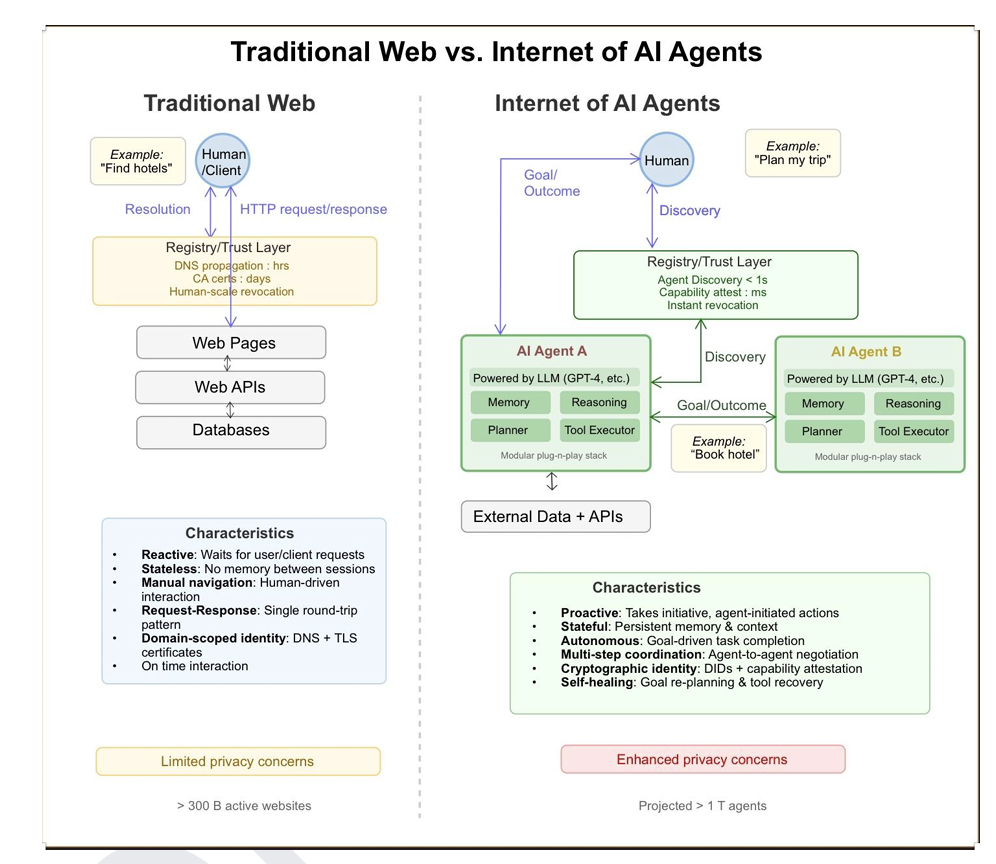
    
<strong style="color: var(--nanda-black);">The Paradigm Shift:</strong> Comparing the reactive Traditional Web with the proactive, stateful Internet of AI Agents.

  

  

    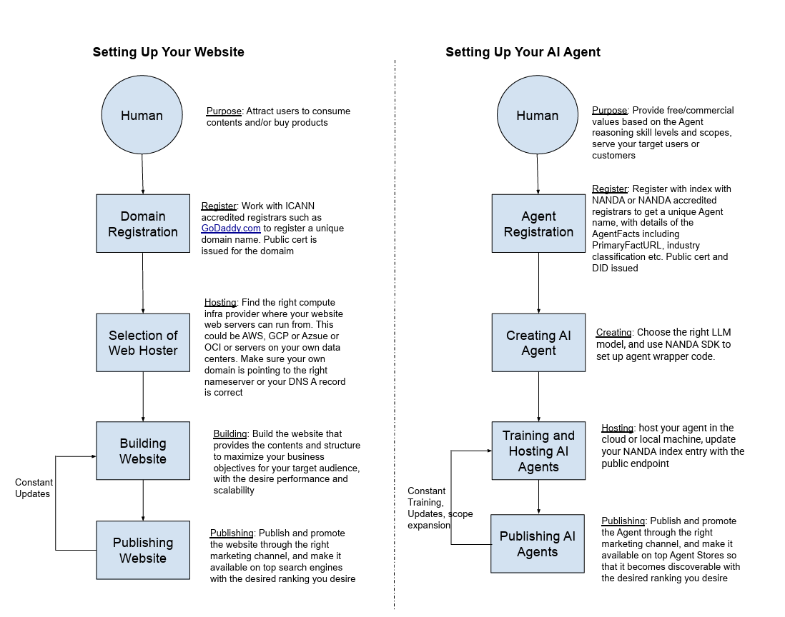
    
<strong style="color: var(--nanda-black);">Lifecycle Management:</strong> The parallel processes of Domain Registration vs. Agent Registration and discovery.

  

  

    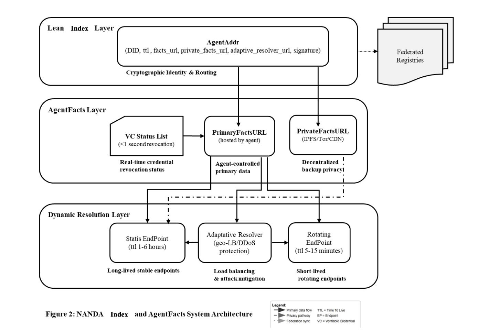
    
<strong style="color: var(--nanda-black);">Core Stack:</strong> The NANDA Index, AgentFacts Layer, and Dynamic Resolution Layer.

  

  

    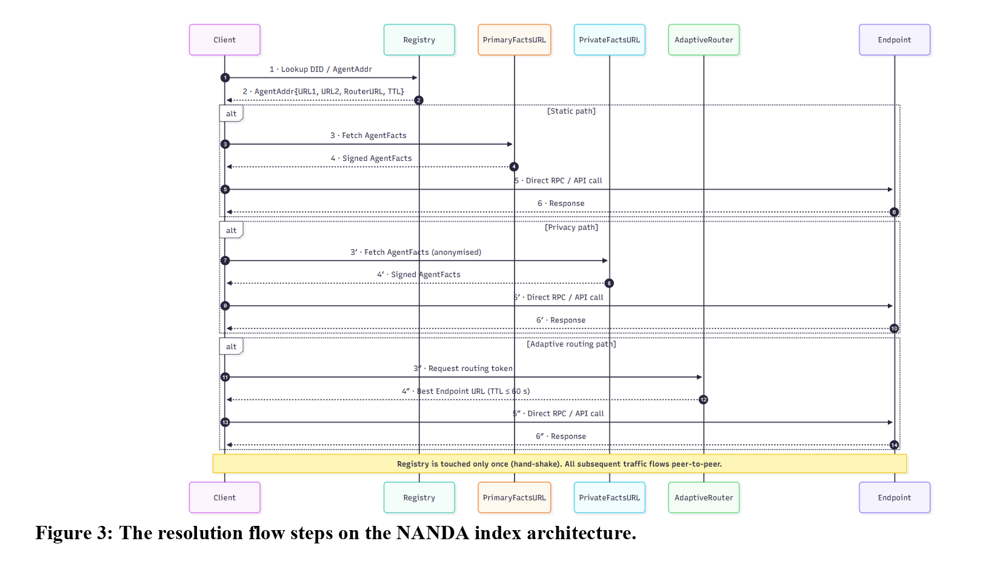
    
<strong style="color: var(--nanda-black);">Resolution Protocol:</strong> The cryptographic handshake and privacy-preserving lookup flow.

  

  

    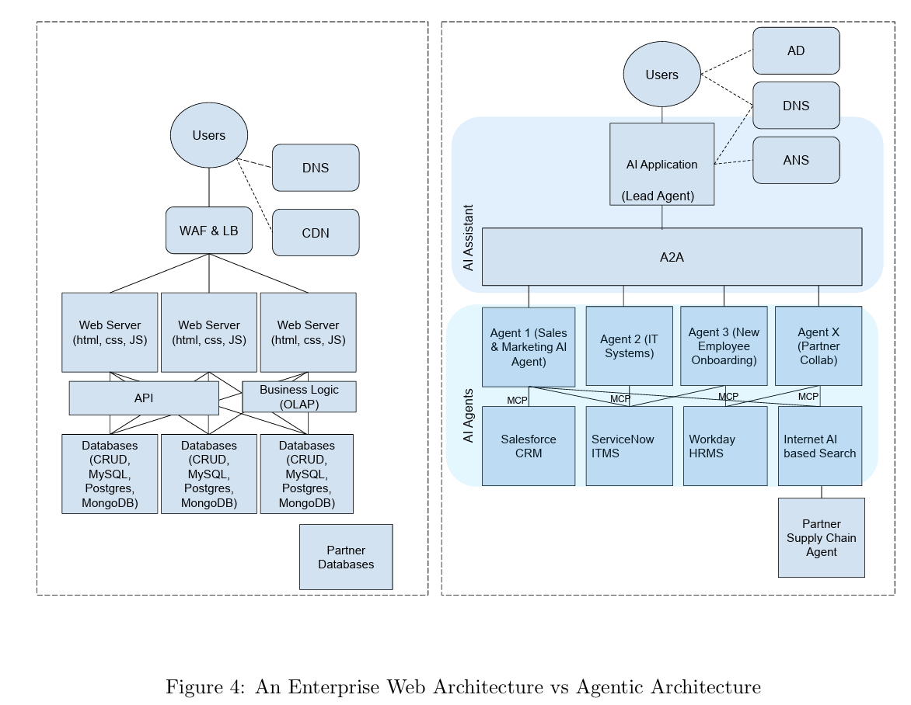
    
<strong style="color: var(--nanda-black);">Enterprise Infrastructure:</strong> Moving from WAF/LB/CDN stacks to Agentic A2A/MCP architectures.

  

  

    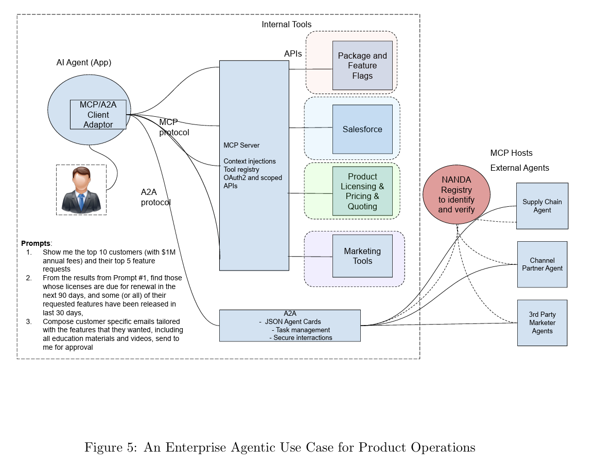
    
<strong style="color: var(--nanda-black);">Applied Operations:</strong> A Product Operations agentic workflow using MCP and A2A protocols.

  

  

    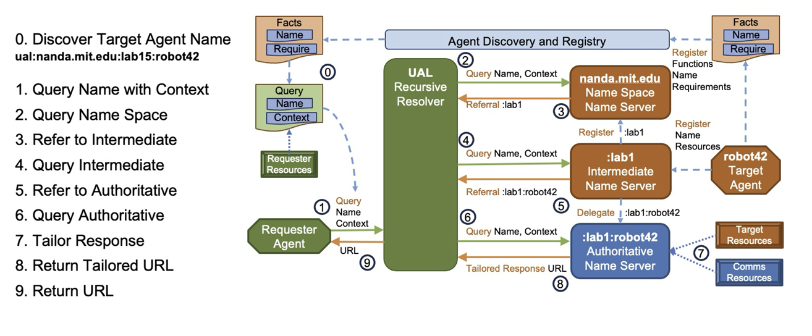
    
<strong style="color: var(--nanda-black);">Recursive Resolution:</strong> How the NANDA Adaptive Resolver queries Namespaces and Intermediates.

  

  

    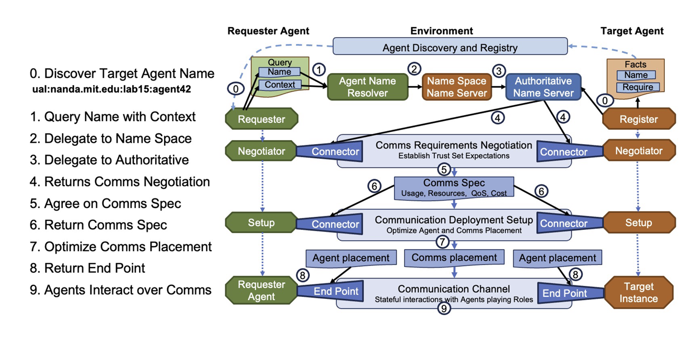
    
<strong style="color: var(--nanda-black);">Connection Negotiation:</strong> The detailed flow of establishing trust and communication specs between agents.

  

---

## Development Roadmap

  

    CURRENT PHASE
    <h3>Phase 1: Foundations</h3>
    
<b>Focus: Onboarding, Indexing, & Discovery</b>

    <ul>
      <li><b>Index Infrastructure:</b> NANDA Index for agent discovery.</li>
      <li><b>Cross-Platform Bridge:</b> Protocol bridges between A2A, MCP, and HTTPS.</li>
      <li><b>Agent Onboarding:</b> SDKs for easy agent deployment.</li>
    </ul>
  

  

    UPCOMING
    <h3>Phase 2: Agentic Commerce</h3>
    
<b>Focus: Knowledge Pricing & Edge AI</b>

    <ul>
      <li><b>Knowledge Pricing:</b> Mechanisms for agents to value/exchange info.</li>
      <li><b>Edge AI:</b> Distributed intelligence at network edges.</li>
      <li><b>Economic Protocols:</b> Incentive systems for agent services.</li>
    </ul>
  

  

    FUTURE VISION
    <h3>Phase 3: Society of Agents</h3>
    
<b>Focus: Large Population Models & Co-learning</b>

    <ul>
      <li><b>LPMs:</b> Collective intelligence from agent populations.</li>
      <li><b>Collaborative Learning:</b> Privacy-preserving co-learning.</li>
      <li><b>Cross-Silo Coordination:</b> Agents working across data boundaries.</li>
    </ul>
  

---

### Orgs, Speakers, & Advisors
<!-- 

  
  
  

--> 

| | | |
| :---: | :---: | :---: |
|  **Ramesh Raskar** Professor & Founder *MIT & Project NANDA* [NANDA (Video)](https://youtu.be/yXxHb3LMygw?si=BTKbSOqJX53dsfJm) |  **John Roese** Global CTO & Chief AI Officer *Dell Technologies* [Fireside Chat (Video)](https://youtu.be/WJ3xGAKqmGs?si=FM1CL7LCF8JYninQ) | 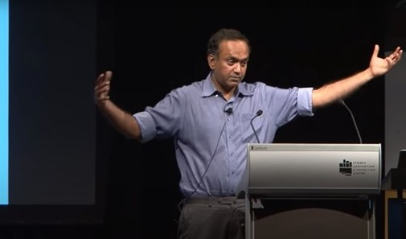 **R.V. Guha** Tech Fellow & Creator *Microsoft & NLWeb* [Rewiring the Web (Video)](https://www.youtube.com/watch?v=P0YKIRD8eQk) |
|  **Jessica Rosenworcel** Former Chair *FCC* [System Design (Video)](https://youtu.be/qQebYJcITno?si=WQxczwmsewHo9x67) |  **Peeyush Aggarwal** Partner *Deloitte UK* [Business Cases (Video)](https://youtu.be/ne-ErV-UJOTc?si=7YvBSq3zrPFSC4_N) |  **Nick Cooper** Member of Technical Staff *OpenAI* [Composable MCP (Video)](https://youtu.be/S2ksXKHbOUU?si=fEQcgaPe5pyWTT4k) |
|  **Todd Segal** Principal Software Engineer *Google* [A2A (Video)](https://youtu.be/_a1yVB04OLk?si=_LXtgOusUILsz-EX) |  **Ashish Bhatia** Senior Product Manager *Audible* [Agentic Web (Video)](https://youtu.be/szO2nzV4ezY?si=KUbWiNxrVNejgaxL) |  **Fatih Porikli** Sr. Director, Global AI Agents *Qualcomm* [On Device Agentic AI (Video)](https://youtu.be/lrkIrvn8P7A?si=u1diMvgsq3JggBa-) |
|  **Rakesh Gohel** Founder *JUTEQ* [Interoperability (Video)](https://youtu.be/_FxSpIXxT_w?si=sAJE1-fdtGRtZRiT) |  **John Zinky** Principal Performance Engineer *Akamai* [NANDA Index (Video)](https://youtu.be/6VpiZAJ9MKw?si=SmPc7AHfFrwVtyzk) |  **Samuel Saraf** Senior Director, Product Mgmt *Salesforce* [Lessons for Agentic Web (Video)](https://youtu.be/APL5nsd4cnU?si=qgugqAkULNtPVpqZ) |
|  **Adam Silverman** Co-Founder & COO *Agency* |  **Aniket Deb** Founder & CEO *Flosync* | 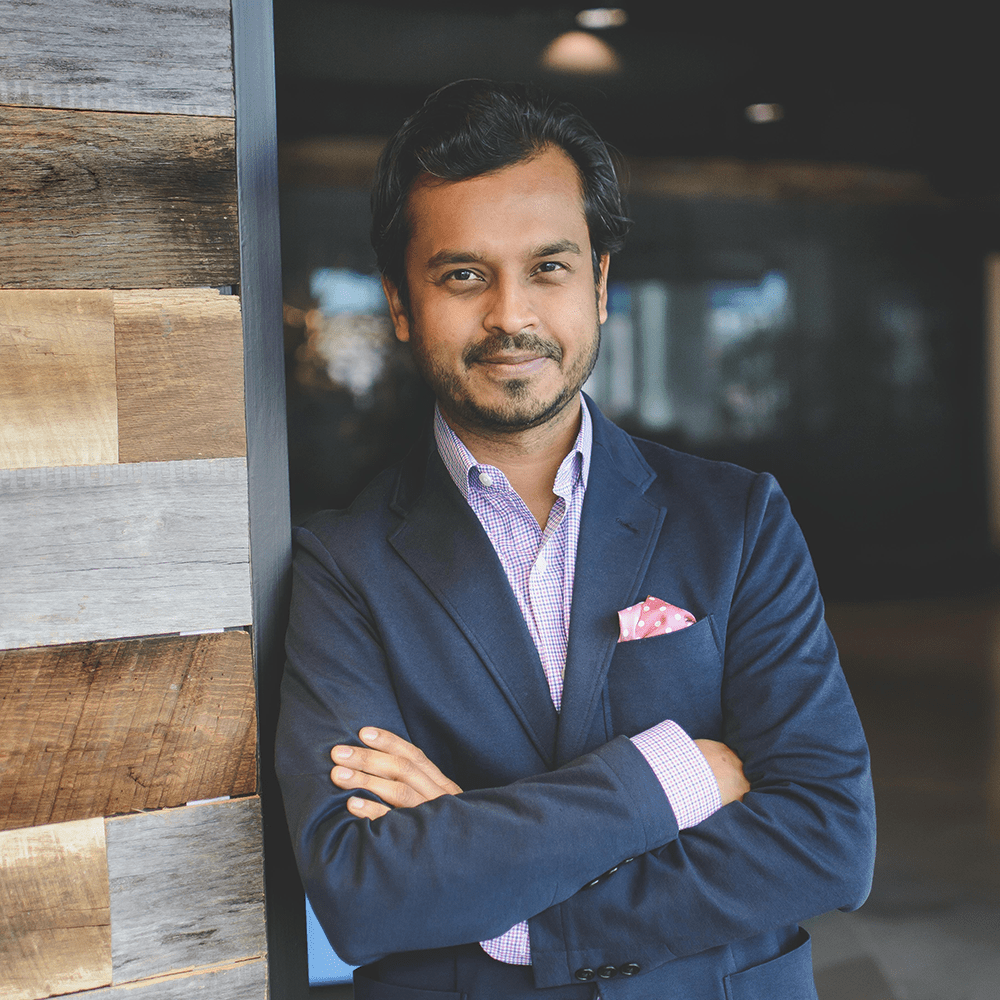 **Abhishek Mehta** Chairman & COO *Tresata* |
|  **Abhishek Singh** Co-Founder & CTO *EON.HEALTH* |  **Alp Ahran Uguray** Senior Solutions Engineer *Snowflake* |  **Amanda McDermott** Senior Software Engineer *Coinbase* |
|  **Andrea Ridi** Co-Founder & Partner *ScaleUp Labs* | 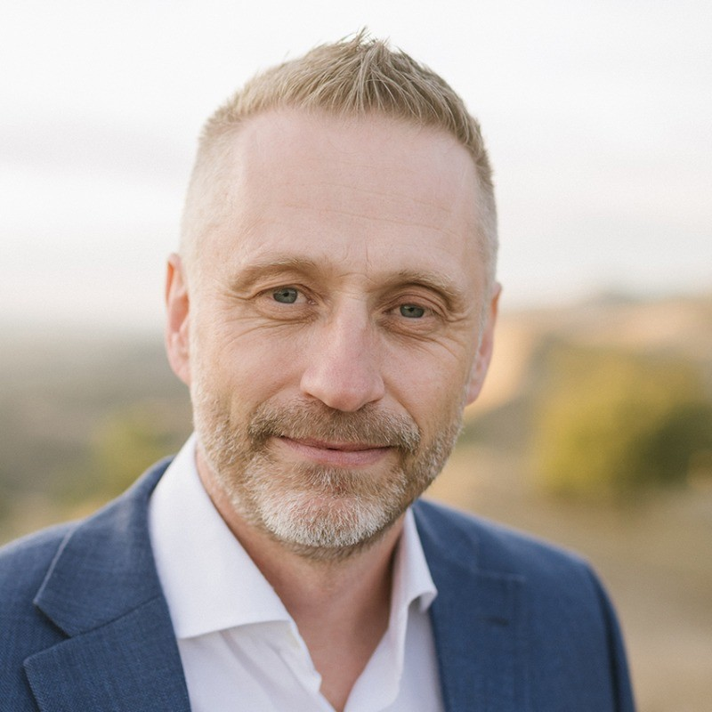 **Andreas Sjostrom** VP & Director of SFO AIE *Capgemini San Francisco* |  **Angela Garabet** Co-Chair *IEEE Boston Blockchain* |
|  **Anna Kazlauskas** Co-Founder *Vana* | 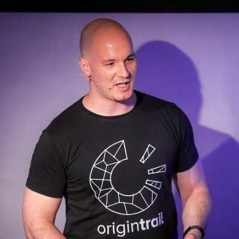 **Branimir Rakic** Co-Founder & CTO *Trace Labs* |  **Chris Pease** Founder & CEO *AgentiCorp* |
|  **Daniel Salinas** Co-Founder & CEO *Remi* |  **Daniela Rus** Director, Robotics *MIT CSAIL* |  **Daniela Zapata** Founder & CEO *WippAI* |
|  **Dawn Song** Professor, EECS *UC Berkeley* |  **Debo Dutta** Chief AI Officer *Nutanix* |  **Diego Maye** Co-Founder *LolosAI* |
|  **Erik Jespersen** President & Co-Founder *MyLife* |  **Gauri Gupta** Member of Tech Staff *Parallel Web Systems* | 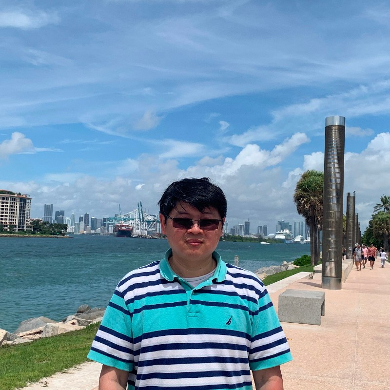 **George Hu** Founder & CEO *DunBack Meadow* |
| 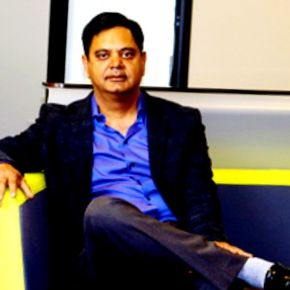 **Gunjan Sinha** Founder & Chairman *OpenGrowth Ventures* |  **Jamil Shinawi** Founder & CEO *AHOY* |  **John Robins** Head of AI & Data Business *Capgemini Invent* |
|  **John Werner** Managing Director *Link Ventures* |  **Juby Jose** Chief Product & Growth *2nd Careers* |  **Jukka Alanen** Founder & Managing Partner *Rebellion Ventures* |
|  **Ken Adler** Technical Fellow, Security *Indeed* |  **Ken Huang** Adjunct Professor *University of San Francisco* |  **Lav Varshney** Director of AI Innovation *Stony Brook University* |
|  **Lee Sanders** Professor *Stanford* |  **Madan Padaki** Managing Trustee *Head Held High Foundation* | 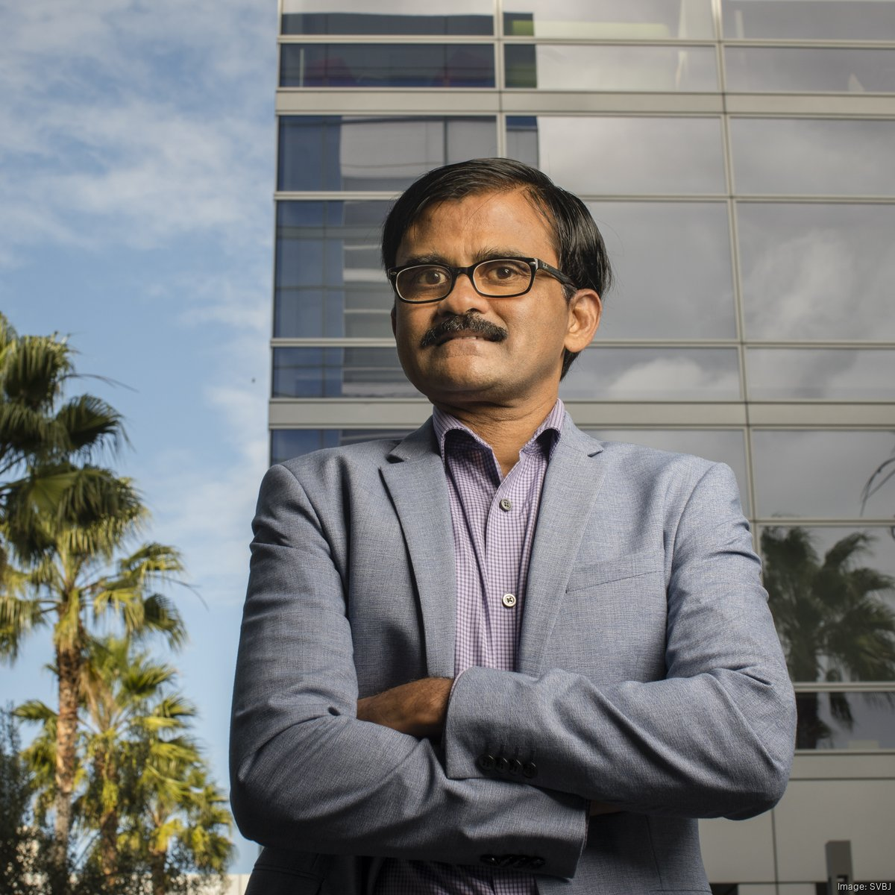 **Mallik Tatipamula** CTO *Ericsson* |
| 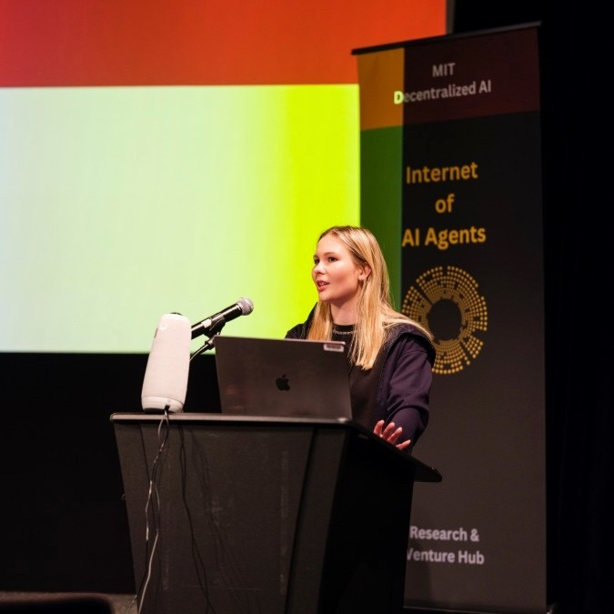 **Maria Gorskikh** Research *MIT* |  **Matt Dionis** Software Engineer *Radius* |  **Michael Demeo** Senior RSM *NVIDIA* |
| 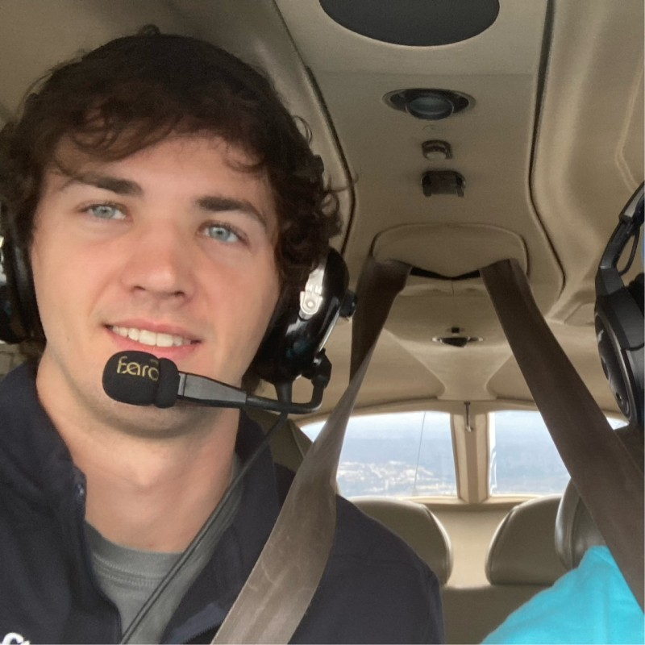 **Morgan Rockett** Co-Founder *Capybard* |  **Nicolas Lutta** Co-Founder *Xoori* | 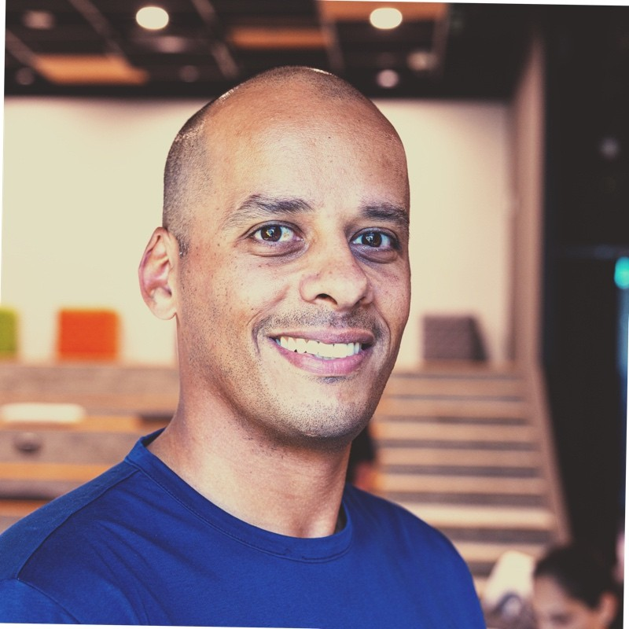 **Omar Hassan** Managing Director *Global Growth Hub* |
|  **Prof. Pattie Maes** Software Agents *MIT Media Lab* |  **Phil McMannis** CEO *Beacon Protocol* | 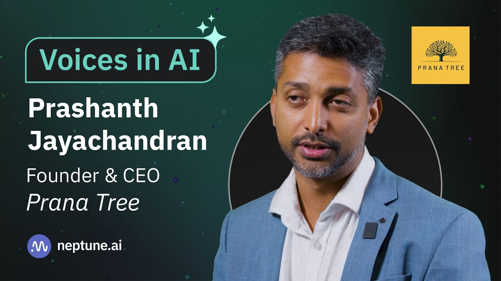 **Prashanth Jayachandran** CEO *PranaTree* |
|  **Raghu Bala** Founder *Synergetics AI* | 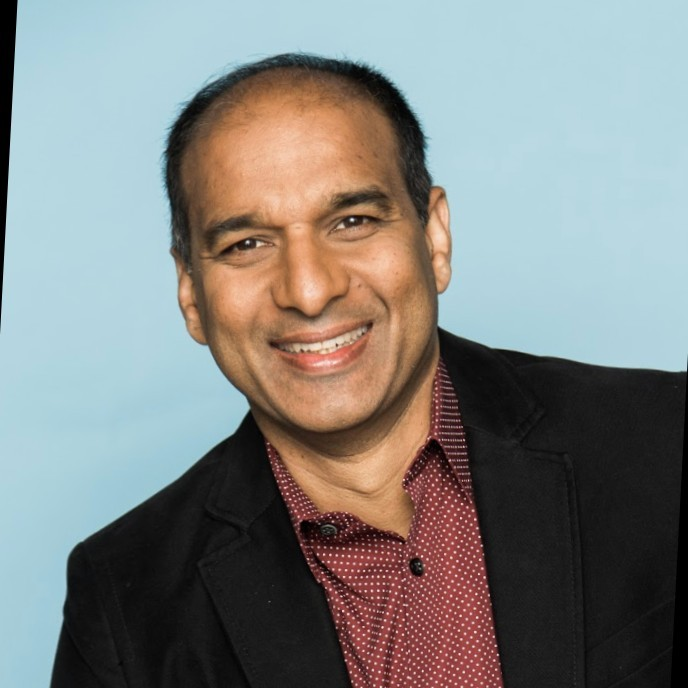 **Rao Surapaneni** Head of A2A *Google* |  **Rishi Sharma** Post Doc *EPFL* |
|  **Rob Blaine** Co-Founder, Managing Partner *TNT* |  **Robert Harrington** Director *SBXI Ventures* |  **Robert Lincourt** Distinguished Engineer *Dell Technologies* |
|  **Rohan Puranik** Partner *WestWave Capital* |  **Santanu Bhattacharya** Scientist *MIT Media Lab* |  **Santiago Garces** Chief Information Officer *City of Boston* |
|  **Scott Courtney** VP Engineering *GoDaddy* |  **Shankar Krishnan** Product Management Leader *AWS* |  **Ashish Chauhan** MD & CEO *NSE* |
|  **Sichao Wang** Senior Manager *Cisco* |  **Tricia Wang** Co-Founder *DAIS* |  **Victor Fong** Sr. Dist. Engineer *Dell* |
| 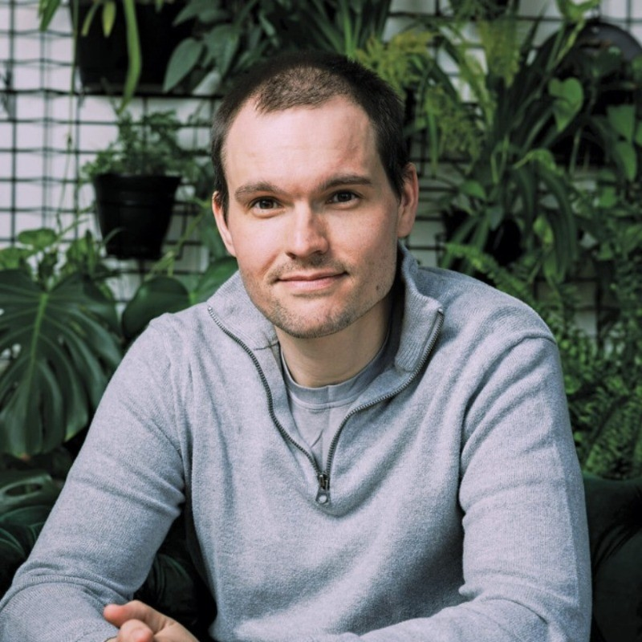 **Wade Foster** Co-Founder & CEO *Zapier* |  **Will Potter** Co-Founder *Natoma* |  **William Lindskog** Solutions Engineer *FlowerLab* |
|  **Erik Reppel** Head of Engineering *Coinbase* |  **Pradyumna Chari** Decentralized AI *MIT Media Lab* |  **Rekha Singhal** Head Research *TCS* |
|  **Mahesh Lambe** Project NANDA *Unify Dynamics* | 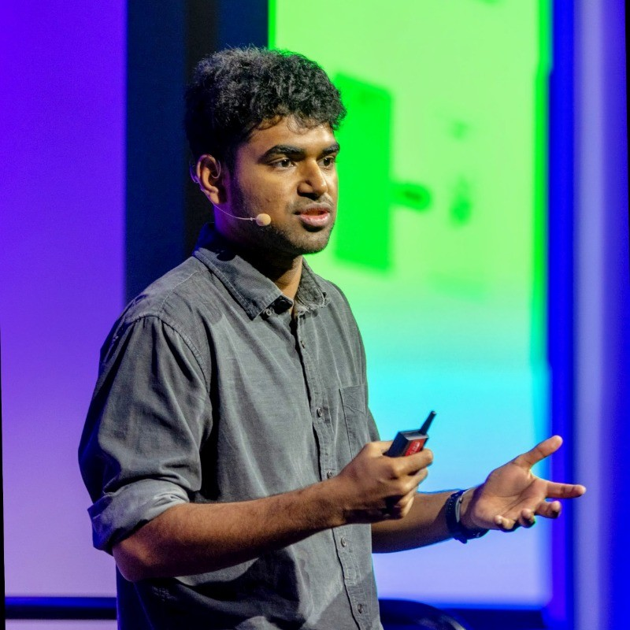 **Vineeth Sai Narajala** Senior Security Engineer *Meta* |  **Vijay Reddy** Partner *Mayfield Ventures* |
| 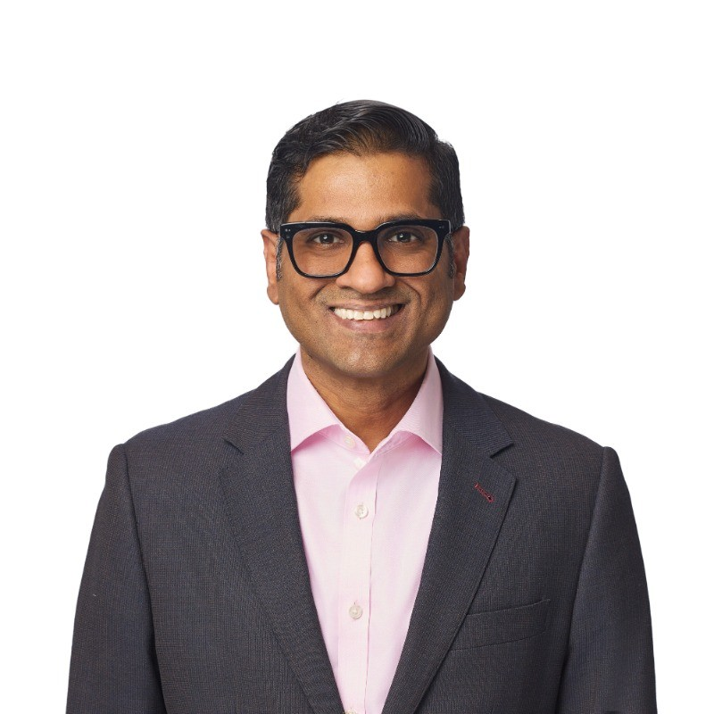 **Shyam Nagarajan** COO *HADERA* |  **Mark Castleman** MD, Intel AI Cloud *Intel* | 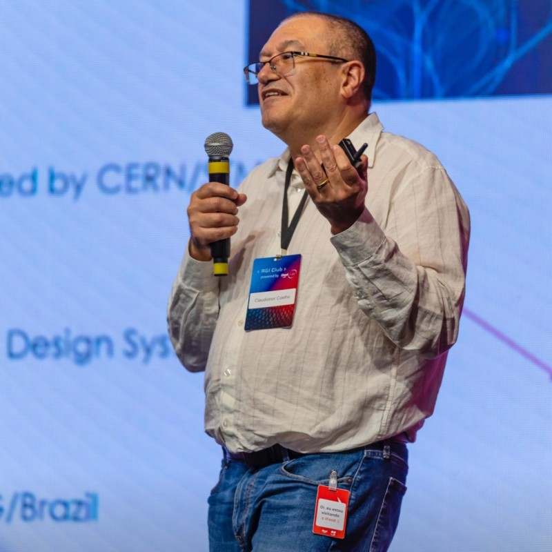 **Claudionor Coelho Jr** Chief AI Officer *Zscaler* |

## See It In Action

* [**Intro to NANDA** (YouTube)](https://www.youtube.com/watch?v=jlcO19XyQ1I)
* [**NANDA Demo** (YouTube)](https://www.youtube.com/watch?v=-S51FOnqF0o)

<iframe src="https://docs.google.com/presentation/d/e/2PACX-1vT819iZm15T-AGmNQl4b4kQd0t2q4_vKHocvoy5ohV3SI0qWmfhKzwf4YdSxCLTEA/pubembed?start=false&loop=false&delayms=3000" frameborder="0" width="960" height="569" allowfullscreen="true" mozallowfullscreen="true" webkitallowfullscreen="true"></iframe>
  

---

## Community & Collaboration

We believe the web must evolve from static content to autonomous actors. **Join us in building the next layer of the web.**

### How to Engage

  <a href="https://discord.gg/BxnPBEqd88" class="engage-card">
    
Discord

    
For technical discussions and community chat.

  </a>
  
  <a href="https://Lu.Ma/nanda" class="engage-card">
    
Events (Lu.ma)

    
Join our weekly webinars and summits.

  </a>

  <a href="https://github.com/projnanda" class="engage-card">
    
GitHub

    
Explore our code and repositories.

  </a>

  <a href="https://docs.google.com/forms/d/e/1FAIpQLScoYg90Ex5IOpBzuSxbnjwjSssJD4rw5U2GpShxACE5t0N4Lw/viewform" class="engage-card">
    
FAN Fellowship

    
Applications are open.

  </a>
<!--
  <a href="https://docs.google.com/forms/d/e/1FAIpQLSemeT9K8WGbggXbFvKlEYj_TQyVrSupxAUonV_W7kO6GOFSIg/viewform" class="engage-card">
    
Tresata Fellowship

    
Apply for paid roles.

  </a>
  <a href="https://www.linkedin.com/jobs/view/4260498540/" class="engage-card">
    
Radius Fellowship

    
Apply for paid roles.

  </a>
 -->

---
### Selected Talks & Resources

* [**Infrastructure for the Internet of AI Agents**](https://www.youtube.com/watch?v=jlcO19XyQ1I)  
  **MIT IIA** — *Index & Vision*

* [**Agent-to-Agent (A2A) Protocol Standard**](https://www.youtube.com/watch?v=_4oBITv0hbs) 
  **Rao Surapaneni (VP Google Cloud)** — *NANDA Summit 2025*

* [**Composable MCP: Emergent Properties of Agent Tooling**](https://www.youtube.com/watch?v=S2ksXKHbOUU) 
  **Nick Cooper (OpenAI)** — *Model Context Protocol*

* [**Reflections on the History of Autonomous Software Agents**](https://www.youtube.com/watch?v=SA3n2o5q07c) 
  **Prof. Pattie Maes - Mother of Software Agents** - *NANDA Summit 2025*

* [**Decentralized AI: The Four Pillars of Trust**](https://www.youtube.com/watch?v=SSSffQsbFo4) 
  **MIT Horizon** — *Privacy-Preserving Machine Learning*

* [**The Dawn of the Agent Economy: From Intranet to Internet of AI Agents**](https://www.youtube.com/watch?v=s1KdGo2_8Lo&pp=ygUNcmFtZXNoIHJhc2thcg%3D%3D) 
  **Prof. Ramesh Raskar** — *MIT Media Lab*

* [**Cognitive Architectures: The Secret to Intelligence (Brains vs. AI)**](https://www.youtube.com/watch?v=zdm6pkW15pE&t=368s) 
  **Prof. Ramesh Raskar** — *Inner Cosmos Podcast*

* [**Networked AI Agents in Decentralized Architectures**](https://www.youtube.com/watch?v=k85IJfbRmXo) 
  **Prof. Ramesh Raskar** — *ADIA Lab Symposium 2025*

* [**Agent Safety Protocols: Child Safety in the Age of AI Toys**](https://www.youtube.com/watch?v=cf_PQKaaYW4) 
  **Chris Aw & Prof. Ramesh Raskar** — *Governance & Ethics*

### Prior Work

* [Decentralized AI](https://youtu.be/RXs6saNBnAE?si=fQIPkDJ4rxfBBel0)
* [No Peek Privacy](https://youtu.be/BEav6MIjmyk?si=q89DFaDybvEc0d8p)
* [Apple Workshop on Machine Learning for Health: Web3 and Decentralized AI (DecAI)](https://machinelearning.apple.com/video/web3-decai)
* [Target AI Video](https://youtu.be/nqJySV2LQGw?si=oeEwu4NjvSrfcy_M)

---

**Made with ♥ by the NANDA Community** 

*Building the Open Agentic Web*

