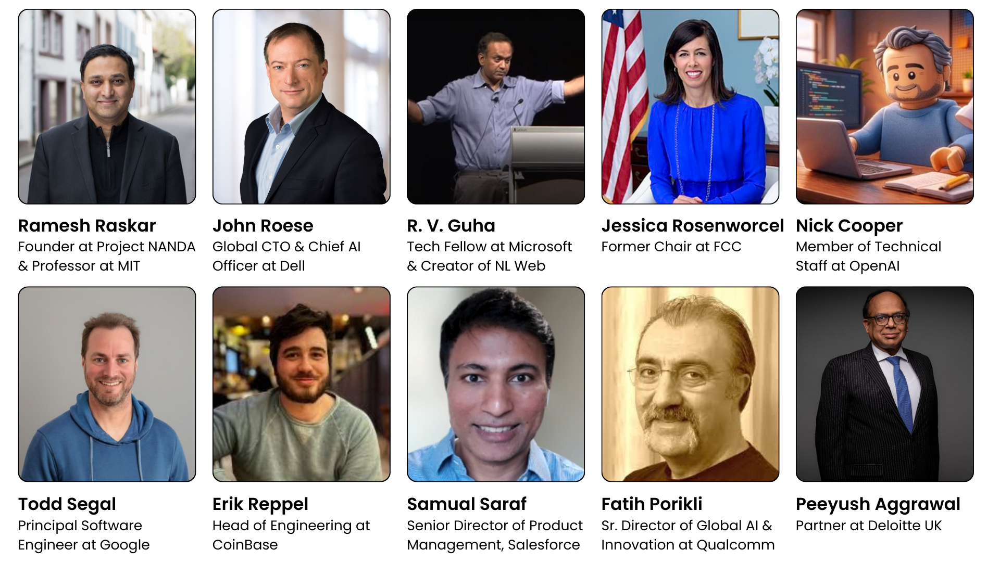

# Project NANDA
### Building the Internet of AI Agents

> **The future isn't just AI — it's trillions of AI agents collaborating across the open web securely.**

---

## What is Project NANDA?

**Project NANDA** is the foundational infrastructure for the **Open Agentic Web**.

We are solving the core challenge of the next decade: How can billions of AI agents discover each other, verify capabilities, and coordinate tasks without creating bottlenecks or security vulnerabilities?

NANDA provides the **index**, **protocols**, and **tools** needed to enable a decentralized, protocol-neutral ecosystem.

* **Infrastructure**: Interop links between heterogeneous agent registries (A2A, MCP, HTTPS).
* **Governance**: Frameworks for a responsible, open agentic web.
* **Discovery**: A privacy-preserving registry architecture.

  

    
6000+

    
Community Members

    
Global Network Participants

  

  

    
61

    
Collaborations

    
Leading Organizations

  

  

    
15+

    
Papers

    
Research Publications

  

  

    
50+

    
Webinars

    
Education Sessions

  

  

    
12

    
Hackathons

    
Innovation Challenges

  

  

    
100+

    
Speakers

    
Industry Experts

  

  

    
75+

    
Projects

    
Active Initiatives

  

  

    
18

    
Locations

    
Global Hubs

  

## Research & Publications

Our research outlines the architectural and strategic foundations of the Agentic Web.

### Core Papers

| Paper Title | Description | Links |
| :--- | :--- | :--- |
| **Beyond DNS: Unlocking the Internet of AI Agents** | *The foundational paper.* Details the design of the NANDA Index, AgentFacts schema, and Verified Agent Discovery. |  |
| **Upgrade or Switch: The Need for New Registry** | Analyzes why DNS fails for AI agents and weighs incremental upgrades against purpose-built registries. |  |
| **NANDA Adaptive Resolver** | A dynamic microservice architecture for agent name resolution in distributed environments. |  |
| **NANDA in Practice: Enterprise Perspective** | Explores Zero Trust Agentic Access (ZTAA) and governance for enterprise agent ecosystems. |  |
| **Survey of AI Agent Registry Solutions** | Compares NANDA, MCP, A2A, and MS Entra across security, scalability, and maintainability. |  |

**[Join our Writing Group](https://projnanda.github.io/projnanda/#/./home/onboardingwritinggroup)** to contribute to upcoming research.

---

## Development Roadmap

  

    CURRENT PHASE
    <h3>Phase 1: Foundations</h3>
    
<b>Focus: Onboarding, Indexing, & Discovery</b>

    <ul>
      <li><b>Index Infrastructure:</b> NANDA Index for agent discovery.</li>
      <li><b>Cross-Platform Bridge:</b> Protocol bridges between A2A, MCP, and HTTPS.</li>
      <li><b>Agent Onboarding:</b> SDKs for easy agent deployment.</li>
    </ul>
  

  

    UPCOMING
    <h3>Phase 2: Agentic Commerce</h3>
    
<b>Focus: Knowledge Pricing & Edge AI</b>

    <ul>
      <li><b>Knowledge Pricing:</b> Mechanisms for agents to value/exchange info.</li>
      <li><b>Edge AI:</b> Distributed intelligence at network edges.</li>
      <li><b>Economic Protocols:</b> Incentive systems for agent services.</li>
    </ul>
  

  

    FUTURE VISION
    <h3>Phase 3: Society of Agents</h3>
    
<b>Focus: Large Population Models & Co-learning</b>

    <ul>
      <li><b>LPMs:</b> Collective intelligence from agent populations.</li>
      <li><b>Collaborative Learning:</b> Privacy-preserving co-learning.</li>
      <li><b>Cross-Silo Coordination:</b> Agents working across data boundaries.</li>
    </ul>
  

---

### Partners

  
  
  

---

## Media Coverage

  <a href="https://www.forbes.com/sites/johnwerner/2025/07/08/line-up-and-identify-yourselves-ai-agents-get-organized-with-nanda/" class="media-card">
    
Line Up and Identify Yourselves — AI Agents Get Organized with NANDA

    
Forbes

  </a>

  <a href="https://www.forbes.com/sites/johnwerner/2025/05/13/make-a-decentralized-internet-with-ai-nanda-is-coming/" class="media-card">
    
Make a Decentralized Internet with AI — NANDA Is Coming

    
Forbes

  </a>

  <a href="https://www.linkedin.com/pulse/nanda-internet-ai-agents-ramesh-raskar-211ve" class="media-card">
    
NANDA: The Internet of AI Agents

    
LinkedIn (Ramesh Raskar)

  </a>

---

## See It In Action

  
  &nbsp;
  
  
  
<em>Click thumbnails to watch demos</em>

---

## Community & Collaboration

We believe the web must evolve from static content to autonomous actors. **Join us in building the next layer of the web.**

### How to Engage

  <a href="https://discord.gg/BxnPBEqd88" class="engage-card">
    
Discord

    
For technical discussions and community chat.

  </a>
  
  <a href="https://Lu.Ma/nanda" class="engage-card">
    
Events (Lu.ma)

    
Join our weekly webinars and summits.

  </a>

  <a href="https://github.com/projnanda" class="engage-card">
    
GitHub

    
Explore our code and repositories.

  </a>

  <a href="https://docs.google.com/forms/d/e/1FAIpQLScoYg90Ex5IOpBzuSxbnjwjSssJD4rw5U2GpShxACE5t0N4Lw/viewform" class="engage-card">
    
FAN Fellowship

    
Applications are open.

  </a>

  <a href="https://docs.google.com/forms/d/e/1FAIpQLSemeT9K8WGbggXbFvKlEYj_TQyVrSupxAUonV_W7kO6GOFSIg/viewform" class="engage-card">
    
Tresata Fellowship

    
Apply for paid roles.

  </a>

  <a href="https://www.linkedin.com/jobs/view/4260498540/" class="engage-card">
    
Radius Fellowship

    
Apply for paid roles.

  </a>

---

**Made with ♥ by the NANDA Community** *Building the Open Agentic Web*

