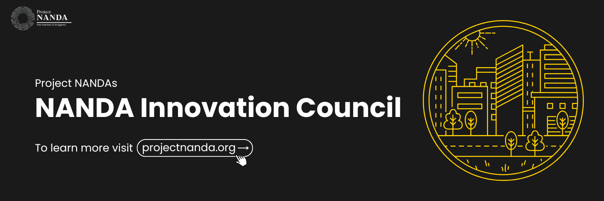

# Agentic Web: Innovation Council for Project NANDA

The **NANDA (Networked Agents and Decentralized AI)** project, which originated at MIT, is pioneering the foundational infrastructure for a true **“Internet of AI Agents”** — imagine billions of specialized AI agents collaborating across a decentralized architecture, performing discrete functions while communicating seamlessly, learning, earning, and transacting on our behalf.

The **Agentic Web: Innovation Council for Project NANDA** is a global initiative to build, organize, and expand communities around decentralized AI. Councils worldwide are contributing to research, open-source code, events, startup partnerships, policy frameworks, and educational initiatives.

---

## 🚀 Join the Innovation Council

We are calling for **Council Leaders** and **Council Members** to help shape the future of the Agentic Web in your city or region.  

### Why Join?
- Become an early adopter in the next wave of AI innovation.  
- Gain deep expertise in **decentralized AI** — a critical skill for the next decade.  
- Collaborate with **15+ AI universities** pioneering distributed AI.  
- Get **early access** to technical specifications, white papers, and commercialization pathways.  
- Connect with the **startup and VC ecosystem** building on NANDA foundations.  
- Engage in workshops, hackathons, and technical deep-dives.  
- Represent the project at global events and get recognized as a **pioneer member**.  

📌 **Apply Here**: [Application Form](https://forms.gle/Pc44vX1Nd9fXiWA99)  
🌐 **Learn More**: [Project NANDA Website](https://projectnanda.org) 

---

## 🕒 Commitment & Schedule

- **Time Investment**: ~1 hour per week  
- **Core Meetup**: Once a month (local chapter decides format — in-person or virtual)  
- **Additional Work**: Committee-specific tasks, collaboration between meetings  

---

## 📌 Innovation Council Committees

We’re seeking members and leaders across specialized focus areas:  

1. **Startup and Developer Connectors**  
   - Partner with AI startups, DevRel teams, and open-source communities.  

2. **VC & Investor Relations**  
   - Bridge NANDA’s ecosystem with VCs and investors.  

3. **External Relations & Policy Council**  
   - Engage with regulators, nonprofits, and ecosystem partners.  

4. **Communications & Social Media**  
   - Amplify NANDA’s mission across digital and professional networks.  

5. **Events Committee**  
   - Organize meetups, hackathons, workshops, and demo days.  

6. **Academic Relations**  
   - Build partnerships with universities and research institutions.  

7. **Research & Publications**  
   - Contribute to white papers, technical documentation, and thought leadership.  

---

## 🌍 How to Set Up a Chapter in Your City

1. **Apply to Become a Chapter Leader**  
   - Fill out the [application form](https://forms.gle/Pc44vX1Nd9fXiWA99) and indicate your interest in founding a new chapter.  

2. **Assemble a Core Team**  
   - Recruit 3–5 motivated members to lead committees (events, research, communications, etc.).  

3. **Host an Introductory Meetup**  
   - Organize a launch event (online or offline) to introduce Project NANDA and gather local interest.  

4. **Build Partnerships**  
   - Reach out to local universities, startups, tech communities, and policymakers.  

5. **Collaborate Globally**  
   - Connect your chapter with other NANDA councils across the world to share resources and insights.  

6. **Contribute to NANDA Initiatives**  
   - Engage in open-source projects, research papers, hackathons, and global events.  

---

## 📬 Get Involved

- **Apply to Join or Start a Chapter**: [Application Form](https://forms.gle/Pc44vX1Nd9fXiWA99)  
- **Website**: [projectnanda.org](https://projectnanda.org)  
- **MIT Media Lab NANDA**: [nanda.media.mit.edu](https://nanda.media.mit.edu/)  

Together, let’s pioneer the **Agentic Web** and build the **Internet of AI Agents**.  
