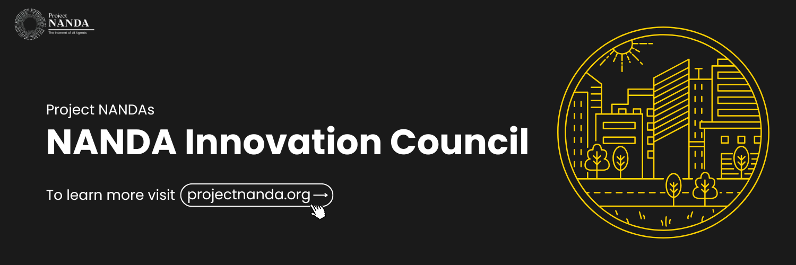

# Agentic Web: Innovation Council for Project NANDA

The **NANDA (Networked AI Agents in Decentralized Architecture)** project, which originated at MIT, is pioneering the foundational infrastructure for a true **"Internet of AI Agents"** — imagine billions of specialized AI agents collaborating across a decentralized architecture, performing discrete functions while communicating seamlessly, learning, earning, and transacting on our behalf.

The **Agentic Web: Innovation Council for Project NANDA** is a global initiative to build, organize, and expand communities around decentralized AI. Councils worldwide are contributing to research, open-source code, events, startup partnerships, policy frameworks, and educational initiatives.

---

## Featured Chapters

  
  <!-- SF Bay Area Card -->
  

    

      
SF Bay Area Chapter

      

        Fostering collaborations across Silicon Valley founders, developers, and academic institutions in the heart of AI innovation.
      

    

    

      <a href="https://www.linkedin.com/showcase/agentic-web-sf-bay-area-chapter" target="_blank" rel="noopener" style="display: inline-block; background: #000; color: #fff; padding: 8px 16px; border-radius: 8px; font-weight: 700; text-decoration: none; font-size: 0.85rem; transition: background 0.2s;" onmouseover="this.style.background='#333';" onmouseout="this.style.background='#000';">LinkedIn</a>
      <a href="https://chat.whatsapp.com/L5jfpeQCv200INAZuziole" target="_blank" rel="noopener" style="display: inline-block; background: #25D366; color: #fff; padding: 8px 16px; border-radius: 8px; font-weight: 700; text-decoration: none; font-size: 0.85rem; transition: background 0.2s;" onmouseover="this.style.background='#20ba5a';" onmouseout="this.style.background='#25D366';">WhatsApp</a>
    

  

  <!-- Milan Card -->
  

    

      
Milan (Italy) Chapter

      

        Pioneering Milan as a pilot for an "agentic city" in collaboration with corporate partners, academic institutions, and local innovators.
      

    

    

      <a href="https://www.projectnandaitaly.org/" target="_blank" rel="noopener" style="display: inline-block; background: #000; color: #fff; padding: 8px 16px; border-radius: 8px; font-weight: 700; text-decoration: none; font-size: 0.85rem; transition: background 0.2s;" onmouseover="this.style.background='#333';" onmouseout="this.style.background='#000';">Visit Website</a>
    

  

  <!-- Bengaluru Card -->
  

    

      
Bengaluru (BLR) Chapter

      

        Connecting India's premier tech hub with the global agentic AI ecosystem, driving local builder meetups, research, and open-source contributions.
      

    

    

      <a href="https://chat.whatsapp.com/F4FgELgoRqjFdX8XvDn9h2" target="_blank" rel="noopener" style="display: inline-block; background: #25D366; color: #fff; padding: 8px 16px; border-radius: 8px; font-weight: 700; text-decoration: none; font-size: 0.85rem; transition: background 0.2s;" onmouseover="this.style.background='#20ba5a';" onmouseout="this.style.background='#25D366';">WhatsApp</a>
    

  

---

## Join the Innovation Council

We are calling for **Council Leaders** and **Council Members** to help shape the future of the Agentic Web in your city or region.

### North America
- **NYC** — [Join WhatsApp Group](https://chat.whatsapp.com/EADxlxKub6FEIUTwsRDEBR)
- [**Agentic Web: SF Bay Area Chapter**](https://www.linkedin.com/showcase/agentic-web-sf-bay-area-chapter) — [Join WhatsApp Group](https://chat.whatsapp.com/L5jfpeQCv200INAZuziole)
- **Boston Area** — [Join WhatsApp Group](https://chat.whatsapp.com/GXWhSLgq1El3Ab0FX72FYr)
- **NJ** — _Coming soon_
- **Seattle** — _Coming soon_
- **Florida** — [Join WhatsApp Group](https://chat.whatsapp.com/LUSZWhTaGhaLuvPxz9tHMm)

### Europe
- **London** — [Join WhatsApp Group](https://chat.whatsapp.com/GN5o8mtfqIUJ2HDmhlywFC)
- **Milan (Italy)** — [Visit Website](https://www.projectnandaitaly.org/)

### Middle East
- **Dubai (UAE)** — [Join WhatsApp Group](https://chat.whatsapp.com/Ev5dRjyMFcvIFdhducWagC)

### Asia
- **Mumbai** — [Join WhatsApp Group](https://chat.whatsapp.com/Es9zEeCABASJglNbYSmaDx)
- **Delhi** — [Join WhatsApp Group](https://chat.whatsapp.com/B5GCDQQ3oGP5mATqhAj23O)
- **Hyderabad** — [Join WhatsApp Group](https://chat.whatsapp.com/FV3UE8ARNsF51PZEWsGkBL)
- **Bengaluru** — [Join WhatsApp Group](https://chat.whatsapp.com/F4FgELgoRqjFdX8XvDn9h2)

### Australia
- _Coming soon_

### Coming Soon
- **Singapore**
- **Toronto**
- **Sydney**
- **Tokyo**

---

### Why Join?
- Become an early adopter in the next wave of AI innovation.
- Gain deep expertise in **decentralized AI** — a critical skill for the next decade.
- Collaborate with **15+ AI universities** pioneering distributed AI.
- Get **early access** to technical specifications, white papers, and commercialization pathways.
- Connect with the **startup and VC ecosystem** building on NANDA foundations.
- Engage in workshops, hackathons, and technical deep-dives.
- Represent the project at global events and get recognized as a **pioneer member**.

**Learn More**: [Project NANDA Website](https://projectnanda.org)

---

## Commitment & Schedule
- **Time Investment**: ~1 hour per week
- **Core Meetup**: Once a month (local chapter decides format — in-person or virtual)
- **Additional Work**: Committee-specific tasks, collaboration between meetings

---

## Innovation Council Committees

We're seeking members and leaders across specialized focus areas:

1. **Startup and Developer Connectors**
   - Partner with AI startups, DevRel teams, and open-source communities.

2. **VC & Investor Relations**
   - Bridge NANDA's ecosystem with VCs and investors.

3. **External Relations & Policy Council**
   - Engage with regulators, nonprofits, and ecosystem partners.

4. **Communications & Social Media**
   - Amplify NANDA's mission across digital and professional networks.

5. **Events Committee**
   - Organize meetups, hackathons, workshops, and demo days.

6. **Academic Relations**
   - Build partnerships with universities and research institutions.

7. **Research & Publications**
   - Contribute to white papers, technical documentation, and thought leadership.

---

## How to Set Up a Chapter in Your City

1. **Apply to Become a Chapter Leader**
   - Indicate your interest in founding a new chapter.

2. **Assemble a Core Team**
   - Recruit 3–5 motivated members to lead committees (events, research, communications, etc.).

3. **Host an Introductory Meetup**
   - Organize a launch event (online or offline) to introduce Project NANDA and gather local interest.

4. **Build Partnerships**
   - Reach out to local universities, startups, tech communities, and policymakers.

5. **Collaborate Globally**
   - Connect your chapter with other NANDA councils across the world to share resources and insights.

6. **Contribute to NANDA Initiatives**
   - Engage in open-source projects, research papers, hackathons, and global events.

---

## Get Involved
- **Website**: [projectnanda.org](https://projectnanda.org)

Together, let's pioneer the **Agentic Web** and build the **Internet of AI Agents**.
