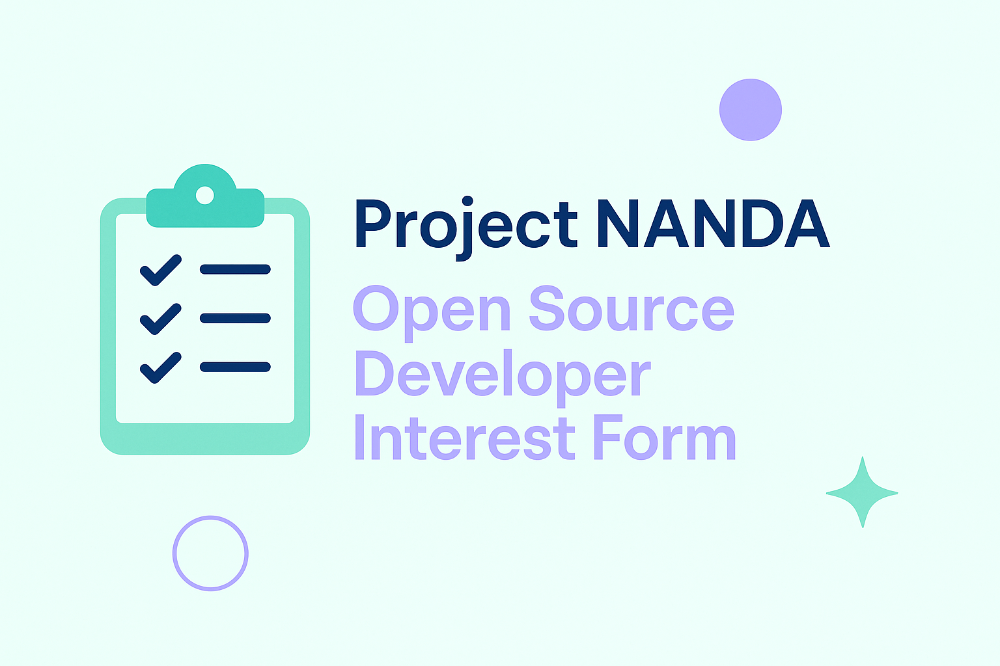

# 🚀 Project NANDA — Open Source Developer Community

Join us in building the foundation for the **Open Agentic Web** — where AI agents can safely discover, verify, and collaborate across systems.

**Project NANDA** (Networked AI Agents in Decentralized Architecture) is an open research and infrastructure initiative under the *Foundation for Agentic Networks (FAN)*. We’re bringing together developers, researchers, and innovators to create the building blocks for the Internet of AI Agents.

---

## 💡 How You Can Contribute
- Work on the **NANDA Index**, SDKs, and decentralized protocols
- Collaborate via GitHub: [github.com/projnanda](https://github.com/projnanda)
- Shape standards and interoperability for agentic ecosystems

---

## 🧠 Get Involved
We’re looking for passionate open-source contributors who want to:
- Code and design next-generation agent registries
- Build governance and interoperability frameworks
- Write documentation, run experiments, and grow the community

👉 **Fill out the interest form to join us:** [Open Source Developer Interest Form](https://forms.gle/your-google-form-link)

---

### 🌍 About NANDA
If the early Internet connected computers, and the Web connected people — the **Agentic Web** will connect autonomous AI agents. NANDA’s mission is to ensure these agents can act, interact, and transact safely in an open, decentralized world.

Learn more at [projectnanda.org](https://projectnanda.org)

---

📧 For questions or collaborations: contact@projectnanda.org

